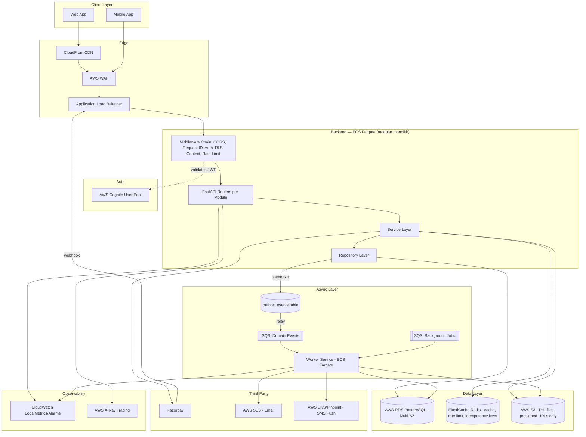

# Anava Clinic — Backend Architecture v1.0

Principal Backend Architecture Design Document
Scope: FastAPI backend for Anava Clinic (neurological care platform), target scale 50M+ patients / 5,000+ clinics / 100K+ concurrent users / multi-country.
Source documents used: `Anava_Master_Document_v1.docx` (authoritative), `Anava_Application_Bible_v3.docx`, `Anava_Clinic_Lifecycle.docx`, `Anava_Patient_Lifecycle.docx`, `memory/CONSISTENCY_REPORT.md`, and the actual implemented schema in `SQL/*.sql` (21 files, ~54 tables — this is newer and more detailed than the Master Document's own Section 15 schema listing).

---

## 0. Source-of-Truth Conflicts Found (read this first)

The task instructions require surfacing contradictions before designing around them. Three real conflicts were found — none were assumptions, all are verifiable in the files.

### 0.1 Master Document's DB schema (Section 15) is stale vs. the actual `SQL/` files — HIGH IMPACT
The Master Document was written first and hand-designed a schema. The `SQL/` folder (21 files, last modified 2026-07-01) is a *later, more mature* iteration that fixed real engineering problems the Master Doc doesn't know about:

| Topic | Master Doc says | `SQL/` actually implements | Verdict |
|---|---|---|---|
| Block naming | `appointment_blocks` / `block_id` | `treatment_cycles` / `cycle_id` | SQL is correct — richer scheduling layer needed a distinct name from the new `appointments` table |
| Doctor load counter | `doctors.active_patient_count INTEGER`, incremented by app code | Column dropped; replaced by `v_doctor_active_patient_counts` view over `doctor_patient_assignments` | SQL is correct. App-maintained counters race under concurrent writes (classic read-modify-write bug at 100K concurrent users) |
| CA↔Doctor relationship | Master Doc doesn't model it explicitly (Bible implies 1 CA : 1 supervising doctor) | `ca_doctor_assignments` many-to-many junction, `is_primary` flag | SQL is correct — matches the real clinic operating model (one CA serves multiple doctors) |
| Scheduling layer | Not modeled at all — Master Doc jumps straight from `assessment_protocol_requests` to `sessions` | Full layer added: `doctor_weekly_schedules`, `doctor_schedule_overrides`, `appointment_requests`, `appointments`, `appointment_audit_logs` | Necessary and correct addition, but **never fed back into the Master Document** |
| Clinical documentation | Not modeled | `doctor_session_notes` (structured S2/S4 notes) | Same — undocumented addition |
| File metadata | Only a narrative S3 folder structure, no tables | `patient_eeg_files`, `patient_medical_history_files` (checksums, versioning via `superseded_by`, review workflow) | Same — undocumented addition |
| In-app notifications | Not modeled (only `activity_logs`, which is an audit trail, not user-facing) | `notifications` table with delivery_channel, read state | Same — undocumented addition |
| PRS system | Simple UUID-keyed 6-table sketch | Full v6-compatible TEXT-PK scoring engine: `prs_disease_scale_map`, `prs_options`, `prs_scale_question_map`, `prs_disease_question_map`, `prs_scale_results`, `prs_final_results`, plus a `recalculate_final_result()` trigger | SQL is a complete scoring engine; Master Doc sketch was a placeholder |

**Recommendation:** `SQL/*.sql` is the schema source of truth going forward, not Master Document Section 15. Do not "fix" the SQL to match the Master Doc. Instead, write a short **Schema Addendum v2** that updates Master Doc Section 15 to match reality (est. 1 day of documentation work) so the two artifacts stop diverging. This is process debt, not code debt — track it, don't block Phase 1 on it.

### 0.2 A real, currently-broken migration statement
`SQL/03_staff_role_tables.sql` explicitly drops `clinical_assistants.supervising_doctor_id` in favor of the `ca_doctor_assignments` junction table (comment at line 42 says so). But `SQL/13_indexes.sql` line 60 still has:
```sql
CREATE INDEX idx_ca_supervising_doctor_id ON clinical_assistants (supervising_doctor_id);
```
This column does not exist. Running `00_run_all.sql` on a fresh database **will fail at this statement** — the schema as committed does not apply cleanly. This is a P0 finding (see Section 22) — trivial to fix (delete the line or repoint it at `ca_doctor_assignments.doctor_id`), but must be fixed before Phase 1 migration work starts, otherwise every engineer's first `alembic upgrade head` breaks.

### 0.3 Original 3 docs vs. Master Doc — already resolved, restated for completeness
`CONSISTENCY_REPORT.md` already caught and resolved this: Application Bible v3 Flow U implies a clinic cannot close with active patients; the Clinic Lifecycle doc and Master Doc both correctly allow `pending_closure` to carry active patients through transfer/exit. No action needed — Master Doc's version stands. Restated here only because the task requires listing all conflicts found across documents, not just new ones.

---

## 1. Executive Summary

Anava Clinic's backend is a **modular monolith** (not microservices — justified in Section 3) built on FastAPI + async SQLAlchemy + AWS RDS PostgreSQL, fronted by AWS Cognito for auth and backed by S3 for file storage, SQS-driven workers for async work, and Razorpay for payments. The domain is a strict multi-stage clinical workflow (7 roles, 6-phase patient lifecycle, 4-session appointment block state machine) layered over a multi-tenant hierarchy (region → clinic → staff/patients) enforced at two levels: application-layer permission checks and PostgreSQL Row-Level Security (defense in depth, not either/or).

The schema is already unusually mature for a pre-code project: soft-deletes everywhere PHI is involved, `FORCE ROW LEVEL SECURITY` on every table (closes the table-owner-bypasses-RLS hole), deferred FKs for legitimate circular references (`appointment_requests` ↔ `appointments`, `prs_assessment_instances` ↔ `prs_final_results`), content-hash-pinned consent records, and a DB trigger audit log that's immune to profile deletion. The main gaps are operational, not conceptual: no partitioning plan for the two append-only log tables at hundreds-of-millions-of-rows scale, no formal RBAC-in-DB (roles are a CHECK constraint, not a joinable table), and no queue/worker layer defined yet. These are addressed below and prioritized in Section 22.

Recommended build order does not change from what's already agreed (`memory/PROJECT_MEMORY.md`): schema is locked, so code starts at Phase 1 — Foundation.

---

## 2. Architecture Decision Records (ADRs)

**ADR-001: Modular Monolith over Microservices.**
At launch, and for years afterward, the write path is dominated by a single linear clinical workflow — splitting it into services would mean every request crosses 3-4 network hops for what's fundamentally one transaction (e.g., booking Session 1 touches `appointment_requests`, `appointments`, `sessions`, `activity_logs`, `notifications` — all in one DB transaction today, and must stay that way for consistency). Adopt now: modular monolith with hard module boundaries enforced by import-linter, not network boundaries. Defer: microservices extraction for Store/Inventory and Notifications specifically — these already look like bounded contexts with their own tables and could become services later without touching clinical core. Migration effort if deferred wrongly and needed later: moderate (2-3 weeks) *if* module boundaries are respected from day one; severe (months) if they aren't.

**ADR-002: Layered (Ports & Adapters / Hexagonal-lite) over pure Clean Architecture.**
Full Clean Architecture (entities/use-cases/interface-adapters/frameworks as 4 concentric rings with strict dependency inversion on the DB) is over-engineering for a team that, per user profile, has limited backend experience and needs to onboard fast. Adopt: a pragmatic 4-layer structure (API → Service → Repository → DB model) with dependency injection for external services (Cognito, S3, Razorpay) so they're mockable in tests, but SQLAlchemy models are used directly as the domain model (no separate "domain entity" duplication layer). This is Hexagonal in spirit (ports = repository interfaces + external service clients) without the ceremony of a fourth entity mapping layer.

**ADR-003: RLS as defense-in-depth, not primary authorization.**
The schema already commits to this (see `15_rls_policies.sql` header comment: "RLS does NOT replace application-level permission checks"). Confirmed as correct: RLS policies read `current_setting()` session variables set once per request; they protect against bugs in the primary check, not replace it. Application code still must gate every endpoint with an explicit permission dependency.

**ADR-004: Async SQLAlchemy 2.0 + asyncpg, single read/write pool at launch.**
Read replicas are premature at launch scale; RDS Multi-AZ gives HA without the complexity of read/write splitting in the app layer. Revisit read replica routing when reporting/dashboard queries start measurably competing with clinical writes for connections (a concrete trigger, not a calendar date — see Section 17).

**ADR-005: SQS + a single worker service over Celery.**
Async workloads here (webhook processing, notification delivery, PDF generation, S3 lifecycle housekeeping) are simple fan-out jobs, not complex DAGs. SQS + a lightweight FastAPI-adjacent worker process (or AWS Lambda for the smallest jobs) avoids running and operating a Celery+broker+beat stack. Celery is justified only if scheduled/periodic jobs with complex retry/chaining semantics emerge — not the case here.

**ADR-006: Event notifications via outbox pattern, not direct pub/sub from request handlers.**
Domain events (Patient Registered, Session Completed, Payment Completed, etc.) are written to an `outbox_events` table in the same transaction as the business write, then a relay process publishes them to SQS/SNS. This guarantees the event is never lost or double-fired relative to the DB commit — a plain "publish to SQS inside the request handler" risks publishing an event for a transaction that then rolls back, or losing an event if the process crashes after commit but before publish.

---

## 3. Backend Architecture — Evaluation

| Style | Fit for this project |
|---|---|
| Microservices | Poor fit at launch. Workflow is a single linear state machine with heavy cross-entity transactions; service boundaries would force distributed transactions or sagas for what's naturally one commit. Revisit only for Store/Notifications once traffic profiles diverge from clinical core. |
| Pure Clean/Onion Architecture | Over-engineered for current team size and experience level. Four-ring dependency inversion adds a mapping layer (domain entities distinct from ORM models) that produces marginal benefit for a domain where the ORM model *is* the domain model. |
| Vertical Slice Architecture | Attractive for the 500+-endpoint future (each feature self-contained, less merge contention), but pure VSA duplicates cross-cutting concerns (auth, RLS context, audit) per slice. Adopt its good idea (organize by feature/module, not by technical layer at the top level) without going full VSA (no cross-slice repository/service reuse). |
| **Modular Monolith (chosen)** | Matches the domain: one deployable, one DB, strict internal module boundaries (enforced by lint rule, see Section 4), each module owns its tables and exposes a service-layer API to other modules — never reaches into another module's repository directly. This is what scales to 500+ endpoints without becoming a ball of mud, and it's what allows extracting a service later if truly needed. |

**Decision:** Modular Monolith, with each module internally organized in the 4-layer style from ADR-002 (router → service → repository → model), and cross-module calls only through service-layer function calls (never repository-to-repository).

---

## 4. High-Level System Architecture



**Component rationale:**
- **CloudFront + WAF** in front of the ALB: WAF handles OWASP-category filtering and rate limiting at the edge (cheaper than doing it in application code for volumetric attacks); CloudFront needed regardless for any static frontend assets and to terminate TLS close to users across regions.
- **ECS Fargate over EKS/Kubernetes at launch:** Kubernetes is "future readiness" per the ask (Section 18), not a day-one requirement — Fargate gives container orchestration, auto-scaling, and rolling deploys without a cluster to operate. Revisit Kubernetes only if a genuine multi-service topology emerges (post microservice-extraction, ADR-001).
- **Redis (ElastiCache):** three concrete jobs, not a vague cache layer — (1) rate limiting counters, (2) idempotency key storage for payment/webhook dedup, (3) hot-read cache for doctor availability/schedule lookups (`doctor_weekly_schedules` + `doctor_schedule_overrides` joined per booking attempt — expensive to compute per request, changes rarely).
- **Outbox table + relay, not direct SQS publish:** see ADR-006.

---

## 5. Folder Structure

```
backend/
├── alembic/                        # migrations — generated FROM SQL/*.sql, not hand-written from scratch
│   └── versions/
├── app/
│   ├── main.py                     # FastAPI app factory, middleware registration, router mounting
│   ├── config.py                   # Pydantic Settings — env-driven, no hardcoded config
│   ├── core/                       # cross-cutting, imported by everything, imports nothing module-specific
│   │   ├── db.py                   # async engine/session factory, SET LOCAL app.current_* helper
│   │   ├── security.py             # JWT validation against Cognito JWKS, password/session helpers
│   │   ├── permissions.py          # role/permission dependency factories (require_role, require_clinic_scope)
│   │   ├── exceptions.py           # exception hierarchy (Section 15)
│   │   ├── middleware.py           # request ID, RLS context injection, timing
│   │   ├── pagination.py           # shared cursor-pagination helper
│   │   └── events.py                # outbox writer helper (used by every module's repository)
│   ├── modules/                    # ONE FOLDER PER BOUNDED CONTEXT — see Section 6 for full list
│   │   ├── auth/
│   │   ├── admin/                  # super/regional/clinic admin, regions, clinics, requests
│   │   ├── staff/                  # doctors, clinical_assistants, receptionists, staff_requests
│   │   ├── patients/
│   │   ├── clinical/               # cycles, assessment_protocol_requests, sessions, treatment_plans/sessions, doctor_session_notes
│   │   ├── scheduling/             # doctor_weekly_schedules, overrides, appointment_requests, appointments
│   │   ├── prs/
│   │   ├── anamnesis/
│   │   ├── files/                  # patient_eeg_files, patient_medical_history_files, S3 presign
│   │   ├── consent/
│   │   ├── store/                  # products, store_orders, order_items, device_assignments
│   │   ├── inventory/              # inventory, stock_transfers (split from store — different actors/cadence)
│   │   ├── payments/
│   │   ├── notifications/
│   │   ├── audit/                  # read-side of audit_logs/activity_logs (write-side is DB trigger + core/events.py)
│   │   └── reports/                # cross-module read-only dashboards/exports
│   │       each module/:
│   │       ├── router.py           # FastAPI route declarations only — no business logic
│   │       ├── schemas.py          # Pydantic DTOs (request/response) — never expose ORM models directly
│   │       ├── service.py          # business logic, orchestrates repositories, raises domain exceptions
│   │       ├── repository.py       # SQLAlchemy queries only — no business logic, no validation
│   │       ├── models.py           # SQLAlchemy ORM models for tables this module owns
│   │       ├── events.py           # domain event payload builders for this module
│   │       └── dependencies.py     # module-specific FastAPI Depends (e.g. get_patient_or_404)
│   ├── workers/                    # SQS consumers — separate entrypoint, same codebase
│   │   ├── event_relay.py          # outbox_events -> SQS relay
│   │   ├── notification_worker.py
│   │   ├── payment_webhook_worker.py
│   │   └── report_worker.py
│   └── integrations/                # thin clients for external services, injected via Depends
│       ├── cognito.py
│       ├── s3.py
│       ├── razorpay.py
│       ├── ses.py
│       └── sns.py
├── tests/
│   ├── unit/                       # mirrors app/modules structure, mocks repositories/integrations
│   └── integration/                # real Postgres (testcontainers), real RLS policies exercised
├── scripts/
│   ├── bootstrap_superadmin.py
│   └── seed_scales.py
└── pyproject.toml
```

**Why this shape, and the rules that keep it from rotting at 500+ endpoints:**
- **One folder per bounded context, not per technical layer at the top level.** A `routers/`, `services/`, `repositories/` split at the root is what collapses under load — finding everything related to "consent" means jumping three folders. Here, `modules/consent/` is self-contained.
- **Dependency direction is one-way and enforced, not just documented:** `router → service → repository → model`. A router must never import another module's repository or model directly — only another module's `service` (and only its public functions). Cross-module calls: `clinical/service.py` calling `notifications/service.py` to fire a notification is fine; `clinical/repository.py` querying `notifications` tables directly is not. Enforce with `import-linter` (contract file listing forbidden import paths) in CI — this is what actually prevents the drift, not a wiki page.
- **`core/` has zero knowledge of any module.** If `core/` ever needs to import from `modules/`, that logic belongs in a module, not core.
- **Repositories never contain business rules.** E.g., "a session cannot start until payment_status is paid or waived" lives in `clinical/service.py`, not as a conditional inside `treatment_sessions` repository queries. This is what keeps repositories swappable/mockable in unit tests.
- **DTOs (`schemas.py`) are mandatory at the API boundary.** Never return an ORM model from a router — this is both a maintainability rule (schema changes shouldn't silently change API contracts) and a security rule (an ORM model has every column; a DTO has exactly the columns meant to be public — e.g. `patients` has `deleted_by`/`deleted_at` that must never leak to a patient-facing response).
- **`workers/` shares the same `modules/` service layer**, it doesn't reimplement business logic — a worker calls `clinical.service.mark_session_completed(...)` the same way a router does, just triggered by an SQS message instead of an HTTP request.

---

## 6. Module Design

37 tables became ~54 through the SQL evolution (Section 0.1); grouping them into modules by bounded context:

| Module | Owns tables | Responsibilities | Key events produced | Key events consumed |
|---|---|---|---|---|
| **auth** | (none — reads `profiles`) | Cognito JWT validation, session context (`SET LOCAL app.current_*`), MFA/lockout policy | `user_logged_in`, `user_login_failed` | — |
| **admin** | `regions`, `clinics`, `admins`, `clinic_staff_assignments`, `clinic_requests` | Region/clinic lifecycle, admin assignment, clinic request approval chain | `clinic_created`, `clinic_status_changed`, `region_created` | `staff_onboarding_consent_signed` |
| **staff** | `doctors`, `clinical_assistants`, `ca_doctor_assignments`, `receptionists`, `staff_requests` | Staff CRUD, CA↔Doctor assignment, hiring/removal workflow | `staff_request_approved`, `staff_onboarded`, `staff_offboarded` | `consent_signed(staff_onboarding)` |
| **patients** | `patients`, `patient_disease_selection` | Registration state machine (6 steps), MRN issuance (via DB trigger), disease selection | `patient_registered`, `disease_selected`, `registration_completed` | `consent_signed(patient_onboarding)`, `anamnesis_completed`, `prs_completed(general_registration)` |
| **clinical** | `doctor_patient_assignments`, `treatment_cycles`, `assessment_protocol_requests`, `sessions`, `treatment_plans`, `treatment_sessions`, `doctor_session_notes` | Doctor auto-allocation, protocol design/authorization, session sequencing (S1-S4 + treatment), treatment plan chaining | `doctor_allocated`, `protocol_authorized`, `session_completed`, `treatment_plan_created`, `treatment_sessions_completed` | `payment_completed`, `appointment_checked_in` |
| **scheduling** | `doctor_weekly_schedules`, `doctor_schedule_overrides`, `appointment_requests`, `appointments`, `appointment_audit_logs` | Slot availability computation, booking requests, reschedule/cancel, no-show tracking | `appointment_booked`, `appointment_cancelled`, `appointment_rescheduled` | `session_created` (to link `appointments.session_id`) |
| **prs** | `prs_diseases`, `prs_scales`, `prs_disease_scale_map`, `prs_questions`, `prs_options`, `prs_scale_question_map`, `prs_disease_question_map`, `prs_assessment_instances`, `prs_responses`, `prs_scale_results`, `prs_final_results`, `patient_scale_assignments` | Scale assignment, response capture, scoring (DB trigger does aggregation) | `prs_completed`, `prs_scale_assigned` | `disease_selected`, `protocol_authorized` |
| **anamnesis** | `anamnesis_assessments`, `anamnesis_questions`, `anamnesis_options`, `anamnesis_responses` | Medical history questionnaire, versioning across cycles | `anamnesis_completed` | `treatment_cycle_created` (to attach `cycle_id` on updates) |
| **files** | `patient_eeg_files`, `patient_medical_history_files` | Upload orchestration, S3 key generation/enforcement, checksum verification, review workflow | `eeg_uploaded`, `eeg_reviewed`, `file_uploaded` | `session_completed` (attach `session_id`) |
| **consent** | `consent_templates`, `consent_records` | Template versioning, signing, content-hash pinning, revocation (status-only) | `consent_signed`, `consent_revoked` | (triggered by nearly every other module) |
| **store** | `products`, `store_orders`, `order_items`, `device_assignments` | Catalog, device/accessory ordering, Doctor approval gate for devices | `order_created`, `device_order_approved`, `order_collected` | `treatment_sessions_completed`, `payment_completed` |
| **inventory** | `inventory`, `stock_transfers` | Stock levels per clinic/main-branch, dispatch/replenishment | `stock_dispatched`, `stock_received` | `order_created` |
| **payments** | `payments` | Razorpay order creation, webhook verification, waiver, refund | `payment_completed`, `payment_failed`, `payment_waived` | `order_created`, `treatment_session_extended` |
| **notifications** | `notifications` | In-app + email/SMS/push dispatch, read state, retry. Live in-app delivery is SSE, not polling — see Section 25. | (none — terminal consumer) | almost every event above |
| **audit** | `audit_logs` (trigger-written), `activity_logs` (app-written) | Read-side query API for compliance/reporting; `core/events.py` provides the write-side helper every module calls | — | every event, for `activity_logs` projection |
| **reports** | (no tables — cross-module read queries) | Dashboards, exports, aggregate views | — | — |

Standard per-module internals (documented once here, not repeated per row): **Services** implement the business rules table above per module; **Repository layer** is one class per table, plain async SQLAlchemy, no cross-table joins that leak another module's concerns (a join across module boundaries lives in the calling service, or in `reports/` for pure read aggregation); **DTOs** in `schemas.py` — one `*Create`, one `*Update`, one `*Read` per entity minimum; **Validators** are Pydantic field/model validators for shape, business-rule validation (e.g. "doctor must have capacity") lives in the service layer, not the DTO; **Domain models** are the SQLAlchemy models directly (ADR-002).

---

## 7. Request Lifecycle

```
Client
  → CloudFront/WAF (edge filtering, TLS termination)
  → ALB (health-check routing, TLS to origin)
  → FastAPI Middleware chain, in order:
      1. Request ID middleware — generates/propagates X-Request-ID, attaches to structlog context
      2. CORS middleware
      3. Auth middleware — validates Cognito JWT against JWKS (cached), 401 if invalid/expired
      4. Session context middleware — loads profiles record by cognito_sub, opens DB txn,
         runs `SET LOCAL app.current_user_id/role/clinic_id/region_id`
      5. Rate limit middleware — Redis token bucket per user_id + endpoint class
  → Router — path/method match, path param validation, Pydantic request body validation (422 on failure)
  → Permission dependency — `require_role([...])` / `require_clinic_scope()` — 403 if the accessor role/scope check fails (BEFORE any query touches PHI)
  → Service layer — business rule checks (e.g. "block cannot have two active cycles"), orchestrates repository calls, builds outbox event payload
  → Repository layer — parameterized async SQLAlchemy queries against RDS
  → PostgreSQL — RLS policies re-check row visibility as a second gate (defense-in-depth per ADR-003); triggers fire (updated_at stamp, audit_logs insert, MRN generation, PRS score recalculation)
  → Response — DTO serialization (never raw ORM), commit outbox_events row in the SAME transaction as the business write
  → Middleware unwind — commit/rollback DB transaction, log request completion with duration + status
  → Client
```

Asynchronously, after commit: the outbox relay picks up new `outbox_events` rows and publishes to SQS; workers consume from there (Section 9/10).

---

## 8. API Design

- **Versioning:** URI-based, `/api/v1/...`. A new major version is a new router prefix, old one kept running until all clients migrate (healthcare clients — hospital-side integrations — cannot be forced onto a breaking change on short notice). Minor/patch-compatible changes (new optional fields) never bump the version.
- **URL conventions:** plural nouns, resource-nested only one level deep (`/patients/{patient_id}/eeg-files`, not `/patients/{id}/cycles/{id}/sessions/{id}/notes`) — deeper nesting is exposed as a top-level resource with the parent as a query filter (`/session-notes?session_id=...`) to keep URLs stable when relationships change.
- **Naming:** `snake_case` in JSON bodies (matches DB columns 1:1 where sensible, reduces mapping bugs), `kebab-case` in URL path segments.
- **Pagination:** cursor-based (`?cursor=...&limit=50`) for all list endpoints, not offset — offset pagination degrades badly past a few hundred thousand rows (a `sessions` table at 50M patients × multiple cycles will be in the billions of rows) and is unstable under concurrent inserts. Offset pagination is not used anywhere in this system.
- **Filtering/Sorting:** allow-listed query params per endpoint (never raw field=value passthrough — that's an injection and an information-disclosure surface), `sort=field:asc|desc` restricted to indexed columns only.
- **Search:** Postgres full-text search (`tsvector`) for launch-scale needs (patient name/MRN lookup, staff lookup); defer OpenSearch/Elasticsearch until search volume or complexity (fuzzy, multi-field relevance ranking) actually demands it — premature to add a second data store for search at day one.
- **Error format:** single envelope, always:
```json
{
  "error": {
    "code": "SESSION_PAYMENT_REQUIRED",
    "message": "Extended session cannot start until payment is completed or waived.",
    "request_id": "req_9f3a...",
    "details": [{"field": "payment_status", "issue": "must be 'paid' or 'waived'"}]
  }
}
```
`code` is a stable machine-readable string (frontend branches on this, not on `message` text, which can be reworded freely without breaking clients).
- **Validation:** Pydantic v2 models for request bodies; 422 with per-field detail on failure.
- **Idempotency:** `Idempotency-Key` header required on all POST endpoints that create money-moving or state-machine-advancing records (payments, order creation, consent signing). Key + endpoint hash stored in Redis with the response, replayed verbatim on retry within a 24h window. This is the general mechanism; `payments.idempotency_key` in the schema is the specific instance of it for Razorpay webhooks.
- **Rate limiting:** per-user token bucket at the auth-role tier (patients: lowest ceiling, staff: higher, service-to-service/webhooks: separate bucket keyed by source, not by user).
- **API lifecycle:** deprecation is a response header (`Deprecation: true`, `Sunset: <date>`) for two release cycles minimum before a version is retired, logged centrally so usage of deprecated endpoints is visible before cutoff.

**Endpoint catalog (representative, grouped by module — full catalog grows with implementation, this is the shape):**

| Module | Sample endpoints |
|---|---|
| auth | `POST /auth/login`, `POST /auth/refresh`, `POST /auth/logout`, `POST /auth/mfa/verify` |
| admin | `POST /regions`, `POST /clinics`, `POST /clinic-requests`, `PATCH /clinic-requests/{id}/approve` |
| staff | `POST /staff-requests`, `PATCH /staff-requests/{id}/approve`, `POST /doctors/{id}/ca-assignments` |
| patients | `POST /patients` (Step 1), `PATCH /patients/{id}/disease-selection`, `GET /patients?registration_status=...` |
| clinical | `POST /assessment-protocol-requests`, `PATCH /assessment-protocol-requests/{id}/authorize`, `POST /treatment-plans` |
| scheduling | `GET /doctors/{id}/availability`, `POST /appointment-requests`, `PATCH /appointments/{id}/reschedule` |
| prs | `POST /prs-assessment-instances`, `POST /prs-assessment-instances/{id}/responses` |
| files | `POST /patients/{id}/eeg-files/presign-upload`, `PATCH /eeg-files/{id}/review` |
| consent | `POST /consent-records`, `PATCH /consent-records/{id}/sign` |
| store | `POST /store-orders`, `PATCH /store-orders/{id}/doctor-approve` |
| payments | `POST /payments/razorpay-order`, `POST /webhooks/razorpay` |

---

## 9. Authentication & Authorization

**JWT flow** (as specified in Master Doc Section 2.3, confirmed sound): Cognito issues access/id/refresh tokens → client sends `access_token` as Bearer → FastAPI middleware validates signature against Cognito's JWKS endpoint (cached with TTL, not fetched per-request) → extract `sub` → look up `profiles` row → attach role + clinic/region scope to request context → router-level permission dependency runs.

- **Refresh tokens:** Cognito-managed refresh token rotation; backend never stores refresh tokens itself.
- **RBAC:** role stored as a `CHECK`-constrained TEXT column today (7 fixed values) — adequate at launch since roles are fixed and few, but flagged as tech debt for a joinable `roles`/`permissions` table once fine-grained permissions (e.g., "this specific Clinic Admin can waive payments but not close the clinic") are needed (Section 22, P1).
- **Permission model:** two explicit dependency factories — `require_role(*roles)` for role-gate checks, `require_clinic_scope()` / `require_region_scope()` for tenant-boundary checks (does this Doctor's `clinic_id` match the resource's `clinic_id`?). Every mutating endpoint must declare both where applicable; enforced by a CI check that greps for endpoints missing a permission dependency.
- **RLS integration:** middleware step 4 in Section 7 (`SET LOCAL app.current_user_id/role/clinic_id/region_id`) is what makes the 15_rls_policies.sql policies functional. This must run inside the same transaction as the query — `SET LOCAL` is transaction-scoped by design, which also means connection pooling must not leak session state across requests (each request gets its own transaction-scoped `SET LOCAL`, never a session-scoped `SET`).
- **Guards:** FastAPI `Depends()` chain — auth guard (valid JWT) always first, then role guard, then resource-ownership guard (e.g., `get_patient_or_404` also checks the caller may see this specific patient) as the last gate before the handler body runs.
- **Session handling:** stateless (JWT), no server-side session store needed beyond what Cognito manages; "logout" is client-side token discard + optional Cognito global sign-out for force-logout-all-devices.
- **Password reset:** delegated entirely to Cognito's built-in forgot-password flow (email/SMS code) — do not reimplement.
- **MFA readiness:** Cognito supports TOTP/SMS MFA per user pool group — enable optionally for admin-tier roles at launch (`super_admin`, `regional_admin`, `clinic_admin`), make mandatory later without a schema change (Cognito-side toggle).
- **Account lockout:** Cognito's built-in adaptive lockout on repeated failed attempts; supplement with an `activity_logs` category=`auth` event on every failure for anomaly detection (feeds Section 14 alerting).
- **Device management:** not in the current schema/docs — flagged as a future enhancement (Section 24), not a launch requirement per the source documents.

---

## 10. Database Layer

- **Repository pattern:** one repository class per table, methods return ORM instances or DTOs — never raw rows, never dicts leaking column names inconsistently.
- **Transaction management / Unit of Work:** one DB transaction per HTTP request (opened in middleware, committed/rolled back after the handler returns) — this is what makes the outbox pattern (ADR-006) correct: the business write and the `outbox_events` insert either both commit or both roll back.
- **Optimistic locking:** not globally applied; apply `updated_at`-based optimistic locking specifically on high-contention single-row updates with concurrent writers — `doctor_patient_assignments` (allocation race, though the view-based capacity check already avoids the worst of this), `treatment_plans` status transitions, `store_orders` status transitions. Pattern: `UPDATE ... WHERE id = :id AND updated_at = :expected_updated_at`, 409 on zero rows affected.
- **Connection pooling:** asyncpg pool sized per ECS task (not per-request), RDS Proxy in front of RDS once task count grows enough that direct connection counts risk exhausting RDS's max_connections (concrete trigger: task count × pool size approaching ~70% of RDS max_connections).
- **Read/write separation:** deferred per ADR-004 — not needed at launch, RDS Multi-AZ standby exists for failover only, not for serving reads. Add a read replica + read-routing in the repository layer specifically for `reports/` module queries once those queries measurably contend with clinical write latency.
- **Retry strategy:** transient errors (connection reset, serialization failures on the rare optimistic-lock or deferred-constraint conflict) retried with exponential backoff at the repository call site, bounded to 3 attempts; business-logic errors (validation, permission) never retried.
- **Pagination strategy:** cursor-based everywhere (Section 8) — cursor is an opaque base64 of `(sort_column_value, id)` to keep it stable and indexable.
- **Query optimization:** every FK column gets an explicit index (Postgres does not auto-index them — `13_indexes.sql` already does this diligently); partial indexes for the "active rows only" 90% case (`clinic_staff_assignments` already does this — `WHERE is_active = TRUE`); `EXPLAIN ANALYZE` gate in CI for any new query touching `sessions`, `appointments`, `audit_logs`, or `activity_logs` (the tables that will be biggest at scale) before merge.

---

## 11. Background Processing

| Job | Trigger | Queue | Notes |
|---|---|---|---|
| Domain event relay | outbox row inserted | (poller, not SQS itself) | Polls `outbox_events` for unpublished rows, publishes to SQS, marks published. Single small dedicated process; simplest possible implementation of the transactional-outbox pattern. |
| Notification delivery | event consumed from SQS | `SQS: notifications` | Fan-out to email (SES) / SMS/push (SNS or Pinpoint) / in-app row insert, per `notifications.delivery_channel`. Retries with backoff, `delivery_attempts` counter already in schema. |
| Payment webhook processing | Razorpay webhook HTTP hit | (inline + `SQS: jobs` for slow parts) | HMAC verification is fast, done inline in the request; anything slow (session unlock cascade, notification fan-out) is pushed to the queue so the webhook responds to Razorpay within its timeout window. |
| Report/export generation | on-demand API call | `SQS: jobs` | Large PDF/CSV exports run async, client polls a job-status endpoint or gets a notification when ready — never generate a multi-thousand-row PDF synchronously inside a request. |
| File processing (EEG upload finalize) | S3 event notification (post-upload) | `SQS: jobs` | Checksum verification against `patient_eeg_files.raw_checksum`, status transition `raw_uploaded → report_pending`. |
| Scheduled reminders | EventBridge cron | `SQS: jobs` | Appointment reminders, follow-up-interval-reached checks, extended-session-payment-pending nudges. |
| Cleanup jobs | EventBridge cron | `SQS: jobs` | Expired `appointment_requests` (past `expires_at`), stale `notifications` past `expires_at`. |
| Audit aggregation | EventBridge cron (nightly) | `SQS: jobs` | Rollup stats off `audit_logs`/`activity_logs` into a reporting-friendly summary table — never queried live off the raw log tables for dashboards. |

**Queue technology: AWS SQS** (standard queues, not FIFO, except the payment webhook queue which should be FIFO keyed by `razorpay_event_id` to guarantee ordered, exactly-once-effective processing given `payments.idempotency_key` already backstops duplicate delivery). **Worker architecture:** a single ECS Fargate worker service with multiple consumer coroutines, one per queue, auto-scaled on `ApproximateNumberOfMessagesVisible` — not one microservice per job type, that's unwarranted operational overhead for this job volume.

---

## 12. Event-Driven Architecture

| Event | Producer | Consumers | Payload (key fields) | Retry | Idempotency |
|---|---|---|---|---|---|
| `patient_registered` | patients service | notifications, audit | `patient_id, clinic_id, mrn` | at-least-once via SQS redrive | consumer keys on `patient_id` (idempotent upsert) |
| `doctor_allocated` | clinical service | notifications | `patient_id, doctor_id, clinic_id` | same | keyed on `doctor_patient_assignments.assignment_id` |
| `protocol_authorized` | clinical service | scheduling (unlocks Session 1 booking), notifications | `patient_id, request_id` | same | keyed on `request_id` |
| `appointment_booked` | scheduling service | notifications | `appointment_id, patient_id, doctor_id` | same | keyed on `appointment_id` |
| `session_completed` | clinical service | notifications, prs (unlock next stage), scheduling (book next session) | `session_id, session_phase, outcome` | same | keyed on `session_id` + `event_type` |
| `treatment_plan_created` | clinical service | notifications, store (device prompt after sessions complete) | `plan_id, patient_id, device_type` | same | keyed on `plan_id` |
| `consent_signed` | consent service | notifications, audit, and the requesting flow (registration/staff/transfer) | `consent_id, consent_type, signer_id` | same | keyed on `consent_id` |
| `prs_completed` | prs service (fired by the DB trigger's completion, relayed by the API layer that observes it) | clinical (may unlock next phase), notifications | `instance_id, patient_id, assessment_stage` | same | keyed on `instance_id` |
| `payment_completed` | payments service (webhook handler) | clinical (unlock extended session), store (advance order status), notifications | `payment_id, session_id or order_id, amount` | same, FIFO queue for this one | `razorpay_event_id`-derived `idempotency_key`, already in schema |
| `inventory_updated` | inventory service | store (order fulfillment progress), notifications | `product_id, clinic_id, quantity` | same | keyed on `stock_transfers.st_id` |

All consumers are written idempotent-by-construction (upsert on the natural key above), because SQS standard queues are at-least-once — exactly-once is not assumed anywhere except the FIFO payment queue, and even there the app-level idempotency key is the real guarantee, the queue is just an optimization.

Every event in this table is also the feed for the live in-app push described in Section 25 — no second event pipeline is created for real-time delivery, the notification worker publishes to Redis pub/sub as an additional side-effect of the same consume step.

---

## 13. File Management

- **Upload flow:** client requests a presigned PUT URL from the backend (`POST /.../presign-upload`) → backend validates the requester may upload for this patient/clinic → backend constructs the S3 key per the enforced path convention (Section 4, Master Doc 2.5) → returns a short-lived presigned URL → client uploads directly to S3 (never through the backend — avoids the backend proxying large binary payloads) → S3 event notification fires → worker finalizes (checksum, status transition).
- **Storage abstraction:** `integrations/s3.py` is the only code in the entire backend allowed to construct an S3 key or call boto3's S3 client — every module's `files`-adjacent needs go through it. This is what makes "frontend never constructs S3 paths" (a Master Doc rule) enforceable server-side too.
- **Virus scanning:** not in the current schema/docs — recommended addition (not currently designed): S3 event → Lambda invoking a scanning service (e.g., ClamAV in a container, or a managed offering) before a file's status moves out of `raw_uploaded`/unreviewed. Flagged as a gap in Section 22 (P1 — PHI file storage without malware scanning is a real risk at healthcare scale).
- **Versioning:** `patient_eeg_files.superseded_by` self-reference already models "corrected version" at the row level; S3 bucket versioning also enabled as a second safety net (accidental overwrite protection), not the primary versioning mechanism.
- **Metadata:** file_name, file_size, mime_type, checksum + algorithm are first-class columns (not buried in JSONB) — correct choice, these are queried/filtered on.
- **Access control:** every file access is a fresh presigned GET, generated only after the requesting user's permission to view *this patient's* file is checked — never a long-lived or public URL.
- **Signed URLs:** short TTL (minutes, not hours) — long-lived signed URLs that get pasted into chat/email become a PHI leak vector.
- **Lifecycle policies:** S3 lifecycle transitions to Glacier/Deep Archive for files past a clinic-configurable inactivity threshold (files are "never deleted" per every source document, but "never deleted" doesn't mean "always on Standard storage tier" — this is a cost lever, not a retention-policy change).

---

## 14. Payment Architecture

- **Gateway integration:** Razorpay order created backend-side before showing checkout — `razorpay_order_id` stored on the `payments` row at creation, `razorpay_payment_id` filled only by the webhook after actual success (never trust a client-side "payment succeeded" callback as authoritative — only the server-to-server webhook is).
- **Webhooks:** `/webhooks/razorpay`, HMAC signature verified against the shared secret before any processing; verified webhook payload stored verbatim in `gateway_response` JSONB for reconciliation/audit.
- **Idempotency:** `payments.idempotency_key` = SHA-256 of `(razorpay_event_id || payment_type)` — already correctly designed in the schema to survive Razorpay's documented at-least-once webhook redelivery.
- **Retry/Failure recovery:** failed webhook processing (5xx from our endpoint) is retried by Razorpay automatically per their redelivery policy; our own worker-side retries apply only to the post-payment side-effects (session unlock, notification), not to the payment record itself.
- **Refunds:** not explicitly in the current schema (`payments.status` includes `refunded` but no refund-initiation flow is documented) — flagged as a gap (Section 22, P2): need a `refund_requests` table or equivalent audit trail of who initiated a refund and why, before this goes live with real transactions.
- **Audit:** every payment row change is captured by the standard `audit_logs` trigger (`trg_audit_payments`) already in the schema — no separate payment-specific audit path needed.
- **Reconciliation:** nightly job compares `payments` table totals against a Razorpay settlement report pull, flags mismatches — not yet designed in the schema/docs, recommended addition for finance operations at scale.

---

## 15. Notification Architecture

- **Channels:** in-app (row in `notifications`), email (SES), SMS/push (SNS or Pinpoint) — all four already modeled via `notifications.delivery_channel`.
- **Retry:** `delivery_attempts` counter + `delivered_at` timestamp already in schema; worker retries with backoff up to a capped attempt count, then marks failed and surfaces to an ops dashboard (silent failure of a "your extended session needs payment" notification is a real business risk, not just a UX nit).
- **Templates:** stored outside the DB (in code or a lightweight template store) keyed by `type` + `category` — not over-engineered into a full CMS; healthcare notification copy needs review/versioning but not a dynamic template editor at launch.
- **Preferences:** not in the current schema — recommended addition (Section 24) once patients/staff want to opt out of specific channels; launch behavior is: every event that has a defined notification maps to `in_app` always, plus email/SMS per a hardcoded-per-event-type default.
- **Scheduling:** reminder-type notifications (appointment reminders) are produced by the scheduled-reminder background job (Section 11), not computed at request time.
- **Delivery tracking:** `is_read`/`read_at` for in-app; `delivered_at` for push channels; email/SMS delivery confirmation via SES/SNS delivery status events, fed back into the same row via `delivery_attempts`/`delivered_at`.

---

## 16. Logging & Observability

- **Structured logging:** JSON logs (structlog or similar) everywhere, never bare `print`/unstructured strings — every log line carries `request_id`, `user_id`, `role`, `clinic_id` from the request context automatically (a logging middleware/processor, not manually threaded through every call site).
- **Correlation IDs:** the `X-Request-ID` generated at the edge (Section 7) is the correlation ID — propagated into `activity_logs.request_id` (already a column), into worker-side logs when processing an event that originated from that request, and into X-Ray trace segments.
- **Audit logs:** `audit_logs` (DB trigger, mechanical) and `activity_logs` (app-written, semantic) — already correctly two-layered per Master Doc Section 12; no additional audit mechanism needed, this is the right design.
- **Metrics:** CloudWatch custom metrics for business-relevant counters (registrations/day, sessions completed/day, payment success rate) in addition to standard infra metrics (latency, error rate, connection pool saturation).
- **Health checks:** `/health` (liveness — process is up) and `/health/ready` (readiness — DB connection pool healthy, can serve traffic) as separate endpoints, both excluded from auth middleware and from rate limiting.
- **Distributed tracing:** AWS X-Ray across API → worker → external service calls (Cognito, S3, Razorpay) — critical for debugging the async event chain (Section 12), where a bug can otherwise hide across 3-4 hops with no single log to grep.
- **Monitoring/Alerts:** CloudWatch Alarms on error rate, p99 latency, queue depth (SQS `ApproximateNumberOfMessagesVisible` growing unboundedly = worker falling behind), RDS CPU/connections/replication lag, failed-login rate spike (security signal).
- **Dashboards:** CloudWatch dashboards per module-group (clinical ops, payments, infra) — not a single undifferentiated dashboard nobody reads.
- **Recommended tools:** CloudWatch + X-Ray as the AWS-native baseline (lowest operational overhead, already implied by the chosen stack); if/when log volume or query needs outgrow CloudWatch Logs Insights, layer in an OpenSearch-based log store — not needed at launch.

---

## 17. Error Handling

**Exception hierarchy** (all inherit from a single `AnavaException` base so a global FastAPI exception handler can catch-all safely):
```
AnavaException
├── ValidationError          → 422, field-level details
├── PermissionError          → 403 (never leak *why* to avoid enumeration — generic message, detailed reason only in logs)
├── NotFoundError            → 404
├── ConflictError            → 409 (optimistic lock failure, duplicate consent, etc.)
├── BusinessRuleError        → 400 (e.g. "extended session requires payment") — always carries a stable `code`
├── ExternalServiceError     → 502/503 (Cognito/S3/Razorpay unavailable) — retryable
└── FatalError               → 500, logged with full stack trace, generic message to client
```
- **Standard error response:** the envelope from Section 8.
- **Validation errors:** Pydantic's own 422 shape, wrapped in the standard envelope for consistency.
- **Business errors:** raised explicitly in service layer with a stable `code` (e.g. `SESSION_PAYMENT_REQUIRED`, `CLINIC_NOT_ACTIVE`, `DOCTOR_AT_CAPACITY`) — frontend logic branches on `code`, never on `message` text.
- **Retryable errors:** `ExternalServiceError` subclasses are caught by the repository-level retry wrapper (Section 10) before ever reaching the client as an error.
- **Fatal errors:** anything unclassified is a 500, logged with full context (never shown to the client — PHI-adjacent stack traces must never leave the server).

---

## 18. Security

Reviewed against the OWASP-category list in the ask, mapped to this specific system:

| Concern | Mitigation |
|---|---|
| SQL Injection | 100% parameterized queries via SQLAlchemy — no raw string interpolation into SQL anywhere, enforced by a lint rule banning `text()` with f-strings |
| XSS | API-only backend, no server-rendered HTML — frontend's responsibility, but API responses set `Content-Type: application/json` strictly and never reflect unescaped user input into any HTML-adjacent field (e.g. consent template rendering) |
| CSRF | N/A for a pure Bearer-token API (no cookie-based session) — confirm the frontend never falls back to cookie auth; if it ever does, add CSRF tokens then |
| SSRF | Any backend-initiated outbound call with a user-influenced URL (none currently designed) would need allow-listing — currently no such surface exists (S3/Cognito/Razorpay calls use fixed, config-driven endpoints) |
| CORS | Explicit origin allow-list per environment, never `*`, credentials mode only for the known frontend origins |
| CSP | Frontend's responsibility, backend supports it by never requiring inline scripts/styles in any HTML it serves (e.g. none — API-only) |
| Secrets management | AWS Secrets Manager for all credentials (DB, Razorpay keys, Cognito app client secret) — never in env files committed to source, ECS task definitions pull at runtime via IAM role |
| Encryption | TLS everywhere in transit (ALB, RDS connections, S3); at rest — RDS encryption enabled, S3 default encryption enabled, plus column-level `pgcrypto` encryption already planned in the schema comments for specific PHI fields (the `pgcrypto` extension is installed specifically for this) |
| File security | presigned URLs only, short TTL, backend-enforced path structure (Section 13) — no direct bucket exposure ever |
| PHI protection | RLS + application permission checks (defense in depth, ADR-003), soft-delete-only on every PHI table (never a hard DELETE on `profiles`/`patients`/clinical tables — confirmed consistently in schema via `ON DELETE RESTRICT` everywhere), audit trail on every mutation |
| Rate limiting | Redis token bucket per user + endpoint class (Section 9), WAF rate rules at the edge for unauthenticated endpoints |
| DDoS mitigation | AWS Shield Standard (automatic with CloudFront/ALB), WAF rate-based rules, Shield Advanced if traffic profile justifies the cost once at meaningful scale |
| Secure headers | `Strict-Transport-Security`, `X-Content-Type-Options: nosniff`, `X-Frame-Options: DENY`, set via middleware on every response |
| Auditability | `audit_logs` (mechanical, trigger-based, un-bypassable by application code) + `activity_logs` (semantic) — already the strongest part of the current design |

**Healthcare-specific note:** the schema already reflects HIPAA-adjacent discipline (soft delete only, append-only audit, consent-content hashing, presigned-URL-only file access) — this is unusually good for a pre-code project and should be preserved, not "simplified" during implementation under time pressure.

---

## 19. Performance

- **Caching:** Redis for (1) doctor availability computation (expensive join across `doctor_weekly_schedules` + `doctor_schedule_overrides` + existing `appointments`, changes rarely, read constantly during booking), (2) JWKS keys, (3) rate-limit counters, (4) idempotency keys. Not a blanket cache-everything approach — cache what's proven hot.
- **Lazy loading:** SQLAlchemy relationships default to explicit loading (`selectinload`/`joinedload` chosen per query), never implicit lazy-load in an async context (this raises `MissingGreenlet` errors in async SQLAlchemy and is a common async ORM footgun — must be avoided by convention, not just habit).
- **Batch operations:** bulk endpoints for genuinely bulk actions (e.g., bulk notification mark-as-read, bulk stock transfer confirmation) — not a batch endpoint for every resource speculatively.
- **Bulk APIs:** same principle — added when a real UI need for multi-select actions exists, not preemptively.
- **Connection pooling:** Section 10.
- **Compression:** gzip/brotli at the ALB/CloudFront layer for API responses over a size threshold.
- **Async processing:** the entire request path is async (FastAPI + asyncpg) — no blocking calls in request handlers; any inherently slow operation (PDF generation, large export) is pushed to the background queue (Section 11), never awaited synchronously in a request.
- **Streaming:** large file downloads (EEG raw files, exports) stream via presigned S3 URLs directly to the client — backend never buffers a large file in memory to proxy it.
- **Pagination:** Section 8/10 — cursor-based everywhere, no exceptions, specifically because `sessions`, `appointments`, `audit_logs`, `activity_logs` are the tables that will have the most rows at scale.

---

## 20. Deployment Architecture

- **Containerization:** Docker, multi-stage build (slim final image, no build toolchain in the runtime image).
- **Orchestration:** ECS Fargate at launch (Section 4 rationale) — Kubernetes (EKS) is future-readiness only, revisit if/when microservice extraction (ADR-001) actually happens and a genuine multi-service topology needs more sophisticated scheduling/service-mesh than ECS gives.
- **AWS architecture:** VPC with public subnets (ALB only) and private subnets (ECS tasks, RDS, ElastiCache) — RDS and Redis never directly internet-reachable; NAT gateway for outbound (Cognito/S3/Razorpay/SES/SNS calls from private subnet tasks).
- **CI/CD:** GitHub Actions (or equivalent) — lint → type-check → unit tests → integration tests (testcontainers Postgres with RLS policies actually applied, not mocked) → build image → push to ECR → deploy to staging → smoke test → manual promote to prod (blue/green, see below).
- **Environment management:** separate AWS accounts (or at minimum separate VPCs) per dev/staging/prod — never shared RDS instances across environments, given PHI is involved even in "staging" if staging ever uses production-shaped data (it should use synthetic data only).
- **Secrets:** Secrets Manager per environment, injected via ECS task definition secrets (not baked into images, not in env files in the repo).
- **Auto scaling:** ECS service auto-scaling on CPU/memory + a custom CloudWatch metric (request queue depth) for the API service; worker service auto-scales on SQS queue depth.
- **Blue/Green deployment:** ECS + CodeDeploy blue/green for the API service — required given this is a live clinical system, a bad deploy must be instantly revertible without a maintenance window.
- **Rolling deployment:** acceptable for the worker service (stateless consumers, in-flight message redelivery handles a mid-deploy restart gracefully given idempotent consumers, Section 12).
- **Backup:** RDS automated snapshots (point-in-time recovery enabled, minimum 30-day retention given healthcare record-keeping expectations), S3 versioning + cross-region replication for the PHI bucket.
- **Disaster recovery:** Section 21.

---

## 21. Disaster Recovery

- **RPO/RTO targets:** RDS Multi-AZ gives near-zero RPO for infrastructure failure (automatic failover to standby, typically under a minute); cross-region DR (separate region standby, restored from cross-region snapshot copy) is the plan for a full region outage, with an RTO measured in hours, not minutes — acceptable for this domain (clinical operations at a single physical clinic degrade gracefully to manual/paper fallback for the duration, they don't stop).
- **Backup verification:** automated periodic restore-and-smoke-test of the latest RDS snapshot into a scratch environment — an untested backup is not a backup.
- **S3 durability:** S3's own 11-nines durability plus cross-region replication for the PHI bucket covers the file-loss scenario independent of the RDS/app-tier DR plan (files and their DB pointer/checksum must both survive together — replication targets are chosen to be consistent).
- **Runbook:** documented failover procedure (who declares a DR event, how DNS/traffic is cut over to the DR region, how the team verifies data consistency post-failover) — not currently written, flagged as a Phase 1 deliverable alongside Foundation, not an afterthought.

---

## 22. Technical Debt Review

| # | Finding | Priority | Recommendation |
|---|---|---|---|
| 1 | `13_indexes.sql` references `clinical_assistants.supervising_doctor_id`, a column dropped in `03_staff_role_tables.sql`. Fresh-DB migration will fail on this statement. | **P0** | One-line fix: delete the stale `CREATE INDEX` or repoint it to index `ca_doctor_assignments(doctor_id)` instead. Must land before anyone runs `00_run_all.sql`/Alembic from scratch. |
| 2 | No partitioning strategy defined for `audit_logs` / `activity_logs` — both explicitly append-only, never-deleted, and the target scale is "hundreds of millions of audit records." Un-partitioned, these become the slowest tables in the system within 1-2 years and every query (even indexed ones) degrades as autovacuum struggles to keep up on a table this size with constant inserts. | **P0** | Design monthly range partitioning (`PARTITION BY RANGE (created_at)`) for both tables before Phase 9 (Logging) implementation, not after data has accumulated — retrofitting partitioning onto a live multi-hundred-million-row table is a much bigger migration than defining it up front. |
| 3 | Roles are a `CHECK`-constrained TEXT column (`profiles.role`), not a joinable table. Fine for 7 fixed roles today; will not scale to fine-grained per-admin permission overrides (e.g., "this Clinic Admin cannot waive payments") without an application-layer permission matrix nobody can query from the DB. | **P1** | Defer the full RBAC table redesign, but track it — introduce a `permissions` + `role_permissions` (or `user_permission_overrides`) table only when a concrete use case demands per-user permission deviation from the role default, not speculatively now. |
| 4 | No PHI file virus/malware scanning step designed anywhere in the upload flow. | **P1** | Add an S3-event-triggered scan step before a file transitions out of an "unreviewed" status (Section 13) — needed before this handles real patient-uploaded documents at scale. |
| 5 | No refund-initiation flow modeled (`payments.status` supports `refunded` but nothing drives a row into that state, and no audit trail of who authorized it). | **P2** | Add before Razorpay refunds are needed operationally — likely alongside the Payments module build (Phase 6a). |
| 6 | Master Document Section 15 schema has drifted materially from `SQL/*.sql` (Section 0.1) — anyone reading only the Master Doc will build against a stale schema. | **P1** | Write the Schema Addendum described in Section 0.1; low effort, high risk if skipped since new engineers will default to reading the polished Word doc over scanning 21 SQL files. |
| 7 | No formal notification-preference model — every user gets every applicable channel by default. Not wrong for launch, but will need a preferences table before this scales past early adopter clinics without becoming a support burden ("stop texting me"). | **P2** | Add `notification_preferences` table when the first real user complaint arrives — don't build it speculatively. |
| 8 | No queue/worker code exists yet (naturally — Phase 1 hasn't started) but nothing in the current schema models job state/dead-letter visibility for the SQS-based workers described in Section 11. | **P2** | Standard SQS dead-letter queue + CloudWatch alarm per queue is sufficient; no new DB table needed for this. |
| 9 | Reporting/analytics (Section 6 `reports` module) has no dedicated read-replica or read-optimized schema yet — at launch this queries the same OLTP tables live. | **P3** | Fine at launch scale; revisit (read replica, or a dedicated OLAP-shaped rollup) once dashboard query load is measurably competing with clinical write latency — a concrete trigger (Section 10), not a calendar date. |
| 10 | `mobile` clinic type exists in the schema/docs but is explicitly marked "NOT YET LAUNCHED" (Master Doc table 4) — code should not build speculative support for it. | **P3** | Confirmed as correctly out of scope; just flagging so nobody accidentally builds it early. |

---

## 23. Implementation Roadmap

Unchanged in substance from the already-agreed order in `memory/PROJECT_MEMORY.md` / Master Document Section 18 — restated here with the architecture decisions from this document folded in, and the P0 fix (finding #1 above) inserted as a blocking pre-step:

| Phase | Work | Depends on | Architecture elements landing in this phase |
|---|---|---|---|
| 0 | Fix `13_indexes.sql` stale index (finding #1); write Schema Addendum (finding #6) | — | — |
| 1. Foundation | Alembic migrations from `SQL/*.sql`, Cognito pool + groups, IAM roles, S3 bucket + folder policy, JWT middleware, `core/` package (db, security, permissions, exceptions, middleware, events/outbox) | Phase 0 | ADR-002 layered structure, ADR-006 outbox table, Section 9 auth |
| 2. Bootstrap | Secrets Manager + `bootstrap_superadmin.py`, force-password-change flow | Phase 1 | — |
| 3. Admin Flows (A-I) | `admin` + `staff` modules | Phase 1 | Section 6 module boundaries established here first — sets the pattern for every later module |
| 4. Patient Registration (J-M) | `patients` module, doctor auto-allocation (uses `v_doctor_active_patient_counts`, not a counter column — confirm this is what gets built, not the stale Master Doc version) | Phase 3 | — |
| 5. Appointment Block (N-R) | `clinical` + `scheduling` modules, payment enforcement gate | Phase 4 | Section 12 events start flowing here (`session_completed`, `treatment_plan_created`) |
| 6a. Store — Orders | `store` module, Razorpay integration | Phase 5 | Section 14 payment architecture |
| 6b. Store — Inventory | `inventory` module | Phase 6a | — |
| 7. Follow-up + Transfers + Exit (S-V) | Follow-up cycle logic, `patient_clinic_transfers` flows | Phase 5 | — |
| 8. Consent System | `consent` module, PDF generation → S3 | Phase 3 (used throughout, so build early enough that Phase 4+ can call it) | Section 13 file architecture |
| 9. Logging | `audit` module read-side; confirm partitioning (finding #2) is in place before this phase, not after | All previous phases | Section 22 finding #2 must land here, not be retrofitted later |
| 10. S3 Integration | `files` module, presigned URL endpoints | Phase 1 (bucket must exist) | Section 13 |
| 11. RLS Policies | Apply `15_rls_policies.sql`, verify via integration tests with real policies (not mocked) | All tables must exist | ADR-003 |
| 12. Background/Async layer | `workers/` package, SQS queues, notification delivery | Phase 1 core, but realistically built alongside whichever phase first needs async delivery (likely Phase 4/5) | Section 11/12 |

---

## 24. Future Enhancements

Explicitly deferred, not designed now, because no current document or schema element demands them yet:

- **Microservice extraction** for Store/Inventory and Notifications, if/when their scaling or team-ownership profile genuinely diverges from clinical core (ADR-001).
- **Read replica + read/write query routing** once reporting load contends with clinical write latency (ADR-004, Section 10).
- **Fine-grained RBAC table** (permissions/role_permissions) once per-user permission deviation from role defaults is a real requirement (finding #3).
- **Notification preferences** once opt-out/channel-preference is a real user request (finding #7).
- **OpenSearch-backed search** if Postgres full-text search stops meeting relevance/latency needs (Section 8).
- **Kubernetes/EKS** if a genuine multi-service topology emerges post microservice-extraction (Section 20).
- **Device management** for auth (multi-device session tracking/revocation) — not in any current source document, would need explicit product requirement first (Section 9).
- **Mobile clinic type** — explicitly marked not-yet-launched in Master Doc; build only when that product decision is made (finding #10).
- **Multi-country deployment** — current schema (`regions.country/state` uniqueness, `clinics.timezone`, `clinics.country` default 'India') is already structured to support it, but multi-currency payments (Razorpay is India-centric), multi-language consent content, and region-specific compliance (beyond what's modeled) all need dedicated design work when a second country is actually scheduled — don't speculatively build multi-currency logic now.

---

## 25. Real-Time Delivery & Selected Algorithms (Addendum)

Added after v1.0 review — covers two decisions not in the original 24 sections: how the frontend gets live updates without polling, and four specific algorithm/data-structure choices selected for correctness and speed at this project's scale. Everything here is additive to Sections 6/12/19 — no existing decision is reversed.

### 25.1 Real-Time Delivery: SSE, not WebSocket/Socket.IO

**Decision:** Server-Sent Events (SSE) for all live in-app push (appointments booked/cancelled/rescheduled, session status changes, payment confirmations, any notification). WebSocket and Socket.IO are explicitly not used anywhere in this system.

**Why:** every live-update need identified so far is one-directional — server tells the browser something changed; the browser never needs to push data back over that same channel (bookings, cancellations, etc. are already normal REST calls). SSE gives exactly that shape: plain HTTP, native browser `EventSource` with built-in auto-reconnect, no client library to add, no special ALB/CloudFront handling beyond normal HTTP. WebSocket (and Socket.IO on top of it) earns its cost only when the client also needs to push frequent data back over the same open connection (chat, collaborative editing) — not the case here. Socket.IO specifically is a Node-ecosystem convention; on a Python backend it's an awkward third-party shim for a capability (bidirectional push) this project doesn't need.

**Where webhooks fit in (different problem, not an alternative):** Razorpay → backend payment confirmation is a webhook (`POST /webhooks/razorpay`, Section 14), not SSE/WebSocket. Direction is reversed — an external company's server calls your endpoint once when their state changes. A browser can't receive an unsolicited inbound call the way a server can, so webhook and SSE are two halves of one system, not competing choices.

**Design:**
1. Every authenticated user (Doctor, Receptionist, Clinic Admin, etc.) opens one SSE connection on login: `GET /events/stream`, identity taken from the existing JWT session context — no separate auth mechanism.
2. Backend subscribes that connection to a Redis pub/sub channel keyed per user: `user:{user_id}:stream`.
3. The notification worker (Section 11) — which already resolves, per domain event, which `profiles` rows should receive a `notifications` row — now also publishes the same payload to each recipient's Redis channel as an additional side-effect of that same consume step. No second event pipeline.
4. The open SSE connection streams it down immediately as an SSE `data:` frame; frontend updates the relevant list/badge/toast without a refresh.
5. Multi-tab/multi-device is free: Redis pub/sub broadcasts to every subscriber on a channel, so two open tabs for the same user both receive it.

**Known gap and its mitigation — durability:** Redis pub/sub is fire-and-forget; a message published while a user's connection is briefly dropped is lost, unlike a durable broker (Kafka/Kinesis). Adopting a durable broker to close this gap is not justified here — the underlying `notifications` row still exists in Postgres regardless, so nothing is actually lost, only the live-push notice of it. Mitigation: on every SSE reconnect, the client sends the last event ID it saw (`Last-Event-ID` header, standard SSE reconnection mechanism) and the backend responds by first replaying anything missed via `GET /notifications?since=<id>`, then resuming the live stream. Same durability outcome as a broker, none of the operational weight of running one.

**Operational notes:** ALB idle-timeout (default 60s) will kill a quiet SSE connection — send a periodic comment-frame keepalive (`: ping\n\n`) every ~30s, or raise the idle timeout for this path. SSE connections are held per ECS task; sizing is driven by concurrently logged-in staff (Doctors/Receptionists/Admins), not by patient count — this is a materially smaller number than the 100K-concurrent-user target and well within normal async-connection capacity.

### 25.2 Algorithm & Data Structure Choices

Selected because a concrete requirement in this project's schema or scale target demands them — not adopted speculatively. Each row states what would otherwise be used, and why the alternative loses here.

| Area | Chosen | Why this beats the naive/default choice for this project |
|---|---|---|
| Index on `audit_logs.changed_at` / `activity_logs.created_at` | **BRIN index** (not B-tree) | Both tables are append-only, insertion-ordered, and headed for hundreds of millions of rows (Section 22 finding #2). BRIN indexes stay tiny (KBs, not GBs) at that size because they summarize block ranges instead of indexing every row — and range queries (`WHERE created_at BETWEEN ...`, the dominant audit/compliance query shape) are just as fast as B-tree when data is this correlated with physical insert order. B-tree remains correct everywhere else (FK lookups, status filters) — this is a targeted swap for these two tables only. |
| Outbox event pickup | **Postgres `LISTEN`/`NOTIFY`** triggering the relay, with polling only as a fallback safety net | A plain polling loop adds up to one poll-interval of latency to every event (booking confirmations, payment unlocks, live notifications all ride this path). `LISTEN`/`NOTIFY` wakes the relay immediately on insert, same outbox-table durability guarantee, no new infrastructure. Poll remains as a periodic reconciliation pass in case a NOTIFY is missed during a relay restart. |
| Rate limiting | **GCRA (Generic Cell Rate Algorithm)** via Redis + Lua script, not naive token bucket | Same O(1) cost and same Redis-only footprint as token bucket, but avoids the burst-then-hard-stall behavior naive token bucket has under concurrent requests hitting the same key — the algorithm Cloudflare/Stripe use for the same reason. Correctness-neutral, strictly better shaping behavior. |
| Overlap prevention (appointment double-booking) | **Postgres `EXCLUDE` constraint (GiST index)** | Confirmed as already the best fit, not just adequate: a distributed lock (e.g. Redis Redlock) would add a network round trip *and* has documented correctness gaps under clock drift/GC pauses (Kleppmann's Redlock critique is the standard reference). A DB constraint checked as part of the write transaction beats a distributed lock on both speed and correctness — no better alternative exists for this specific problem. |

**Explicitly not adopted, and why that's the right call for this project specifically:** vector/ANN search (pgvector/HNSW) and OpenSearch solve fuzzy/semantic search, which nothing here requires yet (MRN/name lookup is exact/prefix); Kafka/Kinesis solve durable event replay at a scale and ops-cost this system's actual event volume doesn't justify; table sharding (Citus) solves a write-throughput/storage ceiling neither `patients` nor any other table is near at 50M rows on a properly indexed single Postgres instance — only the two log tables need partitioning (already tracked as Section 22 finding #2), and that's a partitioning problem, not a sharding one. Revisit any of these only when a measured bottleneck — not a scale target on paper — actually demands it.

---

*End of document. This is v1.0 (Section 25 added post-review) — update alongside the Schema Addendum (Section 0.1) as implementation surfaces new decisions, rather than letting this drift the way Master Document Section 15 did.*
