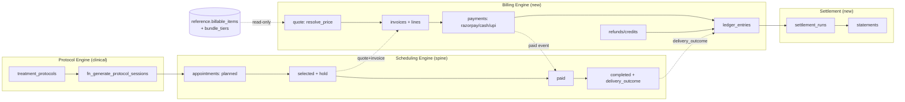

# Anava Payments — Implementation Plan v3.0

**Version:** v3.1 (Planning document — no schema or code changes made)
**Date:** 18 August 2026
**Status:** For review. Nothing in this document has been applied.
**Builds on:** `SQL/v1/30_appointments_spine.sql` → `40_seed_tdcs_reference.sql`, and the `treatment_protocols` backend module — i.e. `main` as of commit `5c7e74c`.
**Supersedes:** `Payments_System_Master_Plan_v1.md` (3 Aug 2026) and `Anava_Payments_Protocol_Sessions_Plan_v2.md` (7 Aug 2026) — see §1.2 for exactly which of their decisions survive and which were overridden by the applied schema.

> **v3.1 reconciliation note.** v3.0 was drafted against `4d056bf` and proposed device capacity as new file `35`. While it was being written, the protocol workstream shipped `35`–`40` — including device capacity (`36`, `37`) and `app/workers/hold_sweeper.py`. This revision renumbers all proposed files to **`41`+**, deletes the now-redundant Phase 1, and corrects three places where v3.0's design disagreed with what was actually built. Those corrections are listed in §1.3.

---

## Table of contents

- [1. Why this document exists](#1-why-this-document-exists)
- [2. Ground truth: what is actually built today](#2-ground-truth-what-is-actually-built-today)
- [3. The five requirements, mapped to the gap](#3-the-five-requirements-mapped-to-the-gap)
- [4. Design rules this plan holds to](#4-design-rules-this-plan-holds-to)
- [5. Target architecture](#5-target-architecture)
- [6. Schema changes — table by table](#6-schema-changes--table-by-table)
- [7. The pricing resolution logic](#7-the-pricing-resolution-logic)
- [8. Protocol → sessions → money: the delivery contract](#8-protocol--sessions--money-the-delivery-contract)
- [9. Rescheduling and cancellation](#9-rescheduling-and-cancellation)
- [10. Settlements](#10-settlements)
- [11. Migration sequence — step by step](#11-migration-sequence--step-by-step)
- [12. Backend module changes](#12-backend-module-changes)
- [13. Defects in the current payments module](#13-defects-in-the-current-payments-module)
- [14. RLS and scoping](#14-rls-and-scoping)
- [15. Edge cases](#15-edge-cases)
- [16. Open decisions requiring your confirmation](#16-open-decisions-requiring-your-confirmation)
- [Appendix A. Complete new-table inventory](#appendix-a-complete-new-table-inventory)
- [Appendix B. Domain events](#appendix-b-domain-events)

---

## 1. Why this document exists

### 1.1 The problem this plan solves

Anava has a payments *skeleton* (`core.payments`, a Razorpay order call, a webhook) and a fully-designed *appointment spine* (`SQL/v1/30`–`34`) that the skeleton cannot serve. Between them sit five requirements with no implementation at all:

1. **Billing** — a money document per visit, receipts, outstanding balances.
2. **Scheduling and rescheduling** with payment consequences.
3. **Device session payments driven by treatment-protocol logic** — a doctor prescribes 20 sessions in one act; the money model has to answer for all 20.
4. **Device follow-up sessions** and **doctor follow-up appointments** — priced differently, generated by protocol cadence.
5. **Settlements** — what flows to doctors, clinic owners, investors and the platform.

### 1.2 Three sources of truth, and which one wins

This is the single most important thing to understand before reading further, because the repo currently contains three mutually inconsistent designs.

| Source | Model | Status |
|---|---|---|
| `Payments_System_Master_Plan_v1.md` | Separate `billing` schema, 18 tables, reservations, price lists scoped region→clinic→doctor, packages | **Superseded.** Never applied. |
| `Anava_Payments_Protocol_Sessions_Plan_v2.md` | v1 plus batch reservations, bundle tiers, protocol versioning, deferred liability — 20+ tables | **Partly superseded.** Never applied. Its *revenue-recognition* and *delivery-outcome* thinking is retained (§8). |
| **`SQL/v1/30`–`34`** | **One payment per visit. `core.appointments` is the single spine. `reference.billable_items` is a flat catalog.** | **APPLIED and live on the sandbox. This is the base.** |

`30_appointments_spine.sql` states the override explicitly:

> *"Deliberately not built: per-clinic/doctor/region price scoping, seasonal price lists, bulk packages. The earlier `Payments_System_Master_Plan_v1.md` specced 18 tables across 7 phases; the agreed model — one payment per visit, one price per item — needs none of it. Scoping gets added when a clinic actually charges differently, not before."*

**This plan builds on `30`–`34` and treats that judgement as correct.** Where a v1/v2 idea is genuinely needed by one of the five requirements, it is reintroduced as a *narrow, additive* layer — never as a rewrite of applied DDL.

What is deliberately **not** revived from v1/v2:

- A separate `billing` schema. Catalog data stays in `reference`, transactional money in `core`, consistent with what is applied.
- `billing.reservations`. The spine's `status='selected'` + `hold_expires_at` **already is** the reservation, and it is protected by the same GIST overlap guards as a paid row. A second hold record would be two sources of truth for one slot.
- Region/clinic/doctor price-list scoping and seasonal price lists. §16-Q1 asks whether you want this; until you do, `billable_items` stays flat.
- Batch reservations. A protocol push already writes N `planned` appointment rows via `fn_generate_protocol_sessions`. That *is* the batch.

What **is** carried forward from v2, because the requirements genuinely need it:

- **Revenue recognised on delivery, not on payment** (v2's D22). You confirmed this. §8 and §10 depend on it.
- **The delivery-outcome contract** (v2's D23) — `completed` / `aborted_clinical` / `aborted_technical` / `aborted_patient` / `not_started`, each mapping to exactly one money consequence.
- **Bundle tiers as a ladder rather than fixed SKUs** — needed because a protocol prescribes an arbitrary session count (17 sessions has no 20-pack price). §7.3.

### 1.3 What v3.1 corrected against the shipped code

Three places where v3.0's design was written ahead of the repo and disagreed with what the protocol workstream actually built. In all three the shipped design is right and this document was changed to match.

| # | v3.0 said | The repo does | Why the repo is right |
|---|---|---|---|
| C1 | Capacity is **per device unit** — `clinic_device_inventory` with a `unit_count`, capacity keyed on `(clinic, device, date, slot)` | Capacity is **per clinic slot** — `clinic_device_schedules.capacity`, one number per slot for the whole clinic | `36`'s own comment settles it: capacity is *"set by the clinic admin judging devices AND assistants on shift together; never computed by the system."* Two tDCS machines and one assistant is a capacity of one, not two. A per-device count cannot express that. |
| C2 | Add `appointments.device_id` so capacity can be counted per device | No such column; the capacity index is `(clinic_id, appointment_date, start_time) WHERE appointment_type='device_session'` | Follows from C1. With clinic-level capacity there is nothing to key a per-device count on, and the device is already reachable via `protocol_id → treatment_protocols.device_id`. |
| C3 | A new `billing_enforcement_enabled` setting as the rollout lever | `settings.appointment_payment_required` already exists, and `hold_sweeper.py` is already written against it | The flag exists, the worker is wired to it, and its docstring explains the bypass behaviour. Inventing a second flag would give two switches for one behaviour. |

Two further alignments, not corrections:

- **`appointment_hold_minutes: int = 15`** already exists in `app/config.py`. §6.5's `hold_minutes.appointment` setting should *migrate* that value into `billing_settings` for per-clinic scoping, not introduce a competing default. The protocol-batch hold (24h) remains genuinely new.
- **`hold_sweeper.py` is built**, correctly implementing the asymmetric delete-vs-revert rule. It is removed from the Phase 4 build list and its existence is now a Phase 4 *dependency* instead.

`appointments.device_id` is dropped from this plan entirely. Price resolution for a device session reaches the device through `protocol_id → treatment_protocols.device_id` (§7.1), which is a real FK since `33`.

---

## 2. Ground truth: what is actually built today

Everything in this section was read from the repo, not assumed.

### 2.1 The appointment spine (applied)

`core.appointments` is now the single row type for every clinic visit. Four appointment types:

| `appointment_type` | Who runs it | Priced by |
|---|---|---|
| `initial` | Doctor | `billable_items.appointment_type` |
| `follow_up` | Doctor | `billable_items.appointment_type` |
| `device_session` | Clinical Assistant (`doctor_id` NULL) | `billable_items.device_id` |
| `protocol_followup` | Doctor | `billable_items.appointment_type` |

The lifecycle from `31_appointments_payment_states.sql`:

```
planned    protocol set a DATE. No slot, no hold. start_time IS NULL.
   ↓  patient picks a time
selected   slot HELD, NOT PAID. hold_expires_at set.
   ↓  payment captured
paid       slot locked permanently, hold cleared.
   ↓
checked_in → in_progress → completed
                         ↘ no_show
cancelled / rescheduled  (terminal)
```

Three applied guarantees that this plan relies on and must not break:

- **`chk_appointments_hold`** — `(status='selected') = (hold_expires_at IS NOT NULL)`. Exactly the held rows carry an expiry, in both directions.
- **`excl_doctor_overlap` / `excl_ca_overlap`** — GIST exclusion keyed on `start_time IS NOT NULL`, so a *held* slot is as occupied as a paid one. `planned` rows drop out on the NULL.
- **Asymmetric expiry.** The sweeper DELETEs an expired `plan_id IS NULL` row (patient-booked, start over) but reverts a `plan_id IS NOT NULL` row (protocol-born) to `planned` with its time cleared — so a payment timeout never destroys a doctor's prescribed date.

### 2.2 The protocol module (applied)

`core.treatment_protocols` — one row per course: `device_id`, exactly one placement FK, exactly one dosing FK (enforced by `num_nonnulls(...) = 1` CHECKs), `session_count`, `follow_up_every_n`.

`core.fn_generate_protocol_sessions(protocol_id, start_date, slot_days, followup_gap)` writes `session_count` device-session rows plus a `protocol_followup` row after every Nth session, all in `status='planned'` with a date and no time. `session_count=20, follow_up_every_n=5` → **24 appointment rows**. It refuses to double-generate.

### 2.3 The price catalog (applied)

`reference.billable_items` — flat, superadmin-owned, one active price per billable thing:

- `category='appointment'` → keyed by `appointment_type`, `device_id` NULL
- `category='device_session'` → keyed by `device_id` (real FK to `reference.neuromod_devices` since `33`), `appointment_type` NULL
- `chk_billable_items_category_shape` enforces exactly one key
- Partial unique indexes give one live price per thing; archived rows keep history via `is_active=false`
- **Zero seed rows on purpose** — "a placeholder price is worse than no price"

### 2.4 What money can do today

`core.payments`: `session_id`, `order_id`, `appointment_id` (added by `30`), `idempotency_key`, `razorpay_order_id/payment_id`, `amount NUMERIC(10,2)`, `status TEXT` (free text, default `pending`), `gateway_response`, `waived_by/reason`, `paid_at`.

Applied constraints: `chk_payments_single_target` (`num_nonnulls(appointment_id, session_id, order_id)=1`) and `uq_payments_one_captured_per_appointment` (partial unique on `status='captured'`).

**A naming conflict to resolve.** `31` writes `uq_payments_one_captured_per_appointment ... WHERE status='captured'`, but the running service (`payments/service.py:78`) writes `status='paid'`. As applied, the index guards a status value the code never produces — the double-charge backstop is inert. §11 Step 2 fixes this.

### 2.5 What does not exist at all

| Missing | Consequence |
|---|---|
| Any invoice / money document | No receipt, no GST-compliant numbering, no outstanding balance |
| Price resolution logic | Nothing reads `billable_items`; no endpoint answers "what does this visit cost" |
| Refunds | `status='refunded'` would be a bare status flip; no gateway call exists |
| Offline (cash/UPI at desk) payments | Not a modelled method |
| Any ledger / settlement concept | Nothing to pay doctors or investors from |
| Revenue recognition | `treatment_sessions.payment_status` is written *before* a session, never after |
| Bundle pricing for arbitrary session counts | A 17-session protocol has no price |

### 2.6 What the protocol workstream shipped (`35`–`40`)

Landed after v3.0 was drafted. All of it is a prerequisite this plan no longer has to build.

| File / module | What it gives the money model |
|---|---|
| `36_clinic_device_schedules.sql` | `clinic_device_schedules` + `_overrides`. The slot pool a `device_session` books against, **clinic-level capacity** (§1.3 C1). Closes OPEN ITEM A from `33`. Shapes deliberately mirror `doctor_weekly_schedules` so `AvailabilityService`'s slot builder is reused, not rewritten. |
| `37_clinic_devices.sql` | `clinic_devices` — which device types a clinic owns, plus `fn_check_device_available_at_clinic()` refusing a prescription on a device the clinic does not have. |
| `38_protocol_flow_completion.sql` | `protocol_custom_montages`, `protocol_scales`, `protocol_conditions`, `protocol_diagnoses`. |
| `39_protocol_prescription_fields.sql` | `treatment_protocols` gains `prescribed_current_ma`, `prescribed_duration_min`, `ramp_seconds`, `sessions_per_week`, `authored_in_appointment_id`, `supersedes_protocol_id`. |
| `40_seed_tdcs_reference.sql` | tDCS reference/catalog seed data. |
| `app/modules/treatment_protocols/` | Router, service, repository, schemas for protocol authoring. |
| `app/workers/hold_sweeper.py` | The asymmetric hold expiry (§2.1), gated on `appointment_payment_required`. |

Note `supersedes_protocol_id` on `treatment_protocols`: protocol amendment is now modelled clinically. §9.4 and §15 E6 describe the money consequences, which remain unbuilt.

---

## 3. The five requirements, mapped to the gap

| # | Requirement | What exists | What this plan adds |
|---|---|---|---|
| R1 | **Billing** | `core.payments`, flat catalog | `core.invoices` + `core.invoice_line_items` + gapless per-clinic-FY numbering; payments rewritten against invoices |
| R2 | **Scheduling / rescheduling** | Full spine FSM, overlap guards, hold column, `hold_sweeper.py` | Payment carry-over on reschedule; configurable windows replacing hardcoded constants |
| R3 | **Device session payments per protocol logic** | Protocol tables + generator + device capacity (`36`/`37`) | Bundle tiers for arbitrary session counts; prepaid vs per-session billing mode; deferred liability |
| R4 | **Device follow-ups + doctor follow-ups** | Generator emits `protocol_followup` rows | Follow-up ordinal/taper pricing; checkpoint anchoring on reschedule |
| R5 | **Settlements** | Nothing | `ledger_entries`, `parties`, `commission_schemes`, `settlement_runs`, `settlement_statements` |

---

## 4. Design rules this plan holds to

These are inherited from the applied files' own stated reasoning, and every later section obeys them.

1. **The appointment row is the unit of billing.** One visit, one line, one payment target. No parallel reservation record.
2. **Price is snapshotted, never referenced live.** An invoice line stores the resolved amount *and* `billable_item_id` provenance. Repricing the catalog never mutates history.
3. **Money rows are append-mostly.** Corrections are new rows (adjustments, credits, reversals), never edits to an issued line.
4. **Revenue is recognised on delivery, not on payment.** Prepaid money is a liability until the session happens. Confirmed by you; drives §8 and §10.
5. **Delivery is an explicit human act.** `delivery_outcome` is set by the person in the room. A session booked and paid for but never administered must never appear as revenue.
6. **Enable RLS and write the policies in the same file.** `NOTES.md` records four tables silently locked out of the app by an `ENABLE` with no policy. Every new table below ships policies alongside.
7. **Every endpoint carries its own app-layer scope check** as if RLS did not exist. RLS *is* now genuinely enforced for `anava_app` (verified 2026-08-13), but the `postgres` migration credential empirically bypasses it — so app-layer checks remain the primary control.
8. **Money is `NUMERIC`, never float.** The current service passes `float` end-to-end; paise conversion can be off by 1p. `Decimal` throughout.

---

## 5. Target architecture

### 5.1 Four cooperating parts



The seam between scheduling and billing is **`appointments.appointment_id`**, not a reservation record. Billing reads the appointment to quote it and writes an invoice that points back at it; scheduling reads `invoice.status` to decide whether a row may move `selected → paid`. Neither writes the other's status column.

### 5.2 Module layout

```
app/modules/billing/              # NEW — absorbs app/modules/payments/
    router_catalog.py       superadmin: billable_items, bundle_tiers, settings
    router_billing.py       quotes, invoices, payments, refunds, offline collection
    router_settlements.py   runs, statements, ledger reports
    service_pricing.py      THE price resolution function (pure logic + reads)
    service_billing.py      invoices, payments, refunds, waivers, credits
    service_recognition.py  deferred liability → revenue on delivery
    service_settlements.py  ledger postings, commission calc, runs
    repository.py           raw-SQL repos, one class per aggregate
    schemas.py

app/modules/scheduling/           # EXTENDED
    service.py              + payment gate on selected→paid, reschedule carry-over,
                              settings-driven windows replacing hardcoded constants

app/modules/clinical/             # EXTENDED
    service_delivery.py     check-in gate, delivery_outcome capture

app/workers/
    hold_sweeper.py         EXISTS — expires 'selected' holds (asymmetric per §2.1)
    billing_recognition.py  NEW — liability → revenue on delivery events
    billing_recon.py        NEW — daily Razorpay settlement reconciliation

app/integrations/razorpay.py      # EXTENDED — webhook secret, refunds, payment fetch
```

---

## 6. Schema changes — table by table

New SQL files start at **`41`**, continuing past the protocol workstream's `35`–`40`. **Nothing below has been written or applied.**

Device capacity — proposed as `35` in v3.0 — is **already built** as `36`/`37`. See §1.3 C1 and §2.6.

### 6.1 `41_appointment_billing_columns.sql` — spine additions

Additive columns on `core.appointments`:

| Column | Type | Why |
|---|---|---|
| `invoice_id` | UUID FK → `core.invoices` | The money document for this visit. Nullable: `planned` rows have none. |
| `delivery_outcome` | TEXT CHECK | `completed` / `aborted_clinical` / `aborted_technical` / `aborted_patient` / `not_started`. The revenue trigger (§8). |
| `delivered_at` | TIMESTAMPTZ | When the outcome was recorded. |
| `billing_state` | TEXT CHECK | `unbilled` / `quoted` / `invoiced` / `settled` / `waived` / `credited`. Lets "which visits still owe money" be one indexed query. |
| `is_billable` | BOOLEAN DEFAULT true | A free/demo visit skips the payment leg without a fake ₹0 payment. |

Plus the two CHECK constraints `31` and `33` deferred — now unblocked, and they **must land in the same migration as the code change** that stops writing the legacy values:

```sql
ALTER TABLE core.appointments ADD CONSTRAINT chk_appointments_type
    CHECK (appointment_type IN ('initial','follow_up','device_session','protocol_followup'));
ALTER TABLE core.appointments ADD CONSTRAINT chk_appointments_status
    CHECK (status IN ('planned','selected','paid','cancelled','rescheduled',
                      'checked_in','in_progress','completed','no_show'));
```

The blockers named in `31`/`33` are real and still present: `scheduling/schemas.py` writes seven legacy type values, `scheduling/service.py:393` and `:488` disagree on the default, and `confirmed` is still reachable via `PATCH /appointments/{id}/status`. §11 Step 4 sequences this.

A delivery-outcome consistency CHECK, so an outcome cannot contradict the status:

```sql
ALTER TABLE core.appointments ADD CONSTRAINT chk_appointments_delivery_outcome
    CHECK (delivery_outcome IS NULL OR status IN ('completed','no_show','cancelled'));
```

### 6.2 `42_billing_invoices.sql` — the money document

This is the heart of R1. Every charge hangs off an invoice, not directly off an appointment — so a visit can be part-paid cash and part-paid online, discounted, waived, or refunded without any of that logic living on the appointment row.

```sql
CREATE TABLE core.invoice_sequences (        -- gapless per-clinic per-FY numbering
    clinic_id    UUID NOT NULL,
    fiscal_year  TEXT NOT NULL,              -- '2026-27' (Indian FY, Apr–Mar)
    last_number  BIGINT NOT NULL DEFAULT 0,
    PRIMARY KEY (clinic_id, fiscal_year)
);
-- Allocation: UPDATE ... SET last_number = last_number + 1 RETURNING, under the
-- row lock. Serialised per clinic+FY, gapless by construction. The number is
-- issued only at status='issued' — never for a draft that may be discarded.

CREATE TABLE core.invoices (
    invoice_id       UUID PRIMARY KEY DEFAULT gen_random_uuid(),
    invoice_number   TEXT UNIQUE,            -- 'ANV/<clinic_code>/2026-27/000123'; NULL while draft
    patient_id       UUID NOT NULL,          -- profiles.id (project convention)
    clinic_id        UUID NOT NULL,
    status           TEXT NOT NULL DEFAULT 'draft' CHECK (status IN
                       ('draft','issued','partially_paid','paid','void',
                        'refunded','partially_refunded','written_off')),
    currency         TEXT NOT NULL DEFAULT 'INR',
    subtotal         NUMERIC(12,2) NOT NULL DEFAULT 0,
    discount_total   NUMERIC(12,2) NOT NULL DEFAULT 0,
    tax_total        NUMERIC(12,2) NOT NULL DEFAULT 0,
    grand_total      NUMERIC(12,2) NOT NULL DEFAULT 0,
    amount_paid      NUMERIC(12,2) NOT NULL DEFAULT 0,
    amount_refunded  NUMERIC(12,2) NOT NULL DEFAULT 0,
    source_type      TEXT NOT NULL CHECK (source_type IN
                       ('appointment','protocol','store_order','manual')),
    protocol_id      UUID,                   -- set when source_type='protocol'
    bundle_snapshot  JSONB,                  -- which tier matched, gross, discount applied
    due_at           TIMESTAMPTZ,
    issued_at        TIMESTAMPTZ,
    voided_at        TIMESTAMPTZ, void_reason TEXT,
    pdf_s3_key       TEXT,
    created_by       UUID NOT NULL, created_by_role TEXT NOT NULL,
    created_at       TIMESTAMPTZ NOT NULL DEFAULT now(),
    updated_at       TIMESTAMPTZ NOT NULL DEFAULT now(),
    CONSTRAINT chk_invoice_number_when_issued
        CHECK ((status = 'draft') = (invoice_number IS NULL)),
    CONSTRAINT chk_invoice_amounts CHECK (
        amount_paid >= 0 AND amount_refunded >= 0 AND amount_refunded <= amount_paid)
);

CREATE TABLE core.invoice_line_items (
    line_id          UUID PRIMARY KEY DEFAULT gen_random_uuid(),
    invoice_id       UUID NOT NULL REFERENCES core.invoices(invoice_id) ON DELETE CASCADE,
    appointment_id   UUID REFERENCES core.appointments(appointment_id),
    billable_item_id UUID REFERENCES reference.billable_items(item_id),  -- provenance
    description      TEXT NOT NULL,
    quantity         INTEGER NOT NULL DEFAULT 1 CHECK (quantity > 0),
    unit_amount      NUMERIC(12,2) NOT NULL,
    discount_amount  NUMERIC(12,2) NOT NULL DEFAULT 0,
    tax_rate_percent NUMERIC(5,2) NOT NULL DEFAULT 0,
    tax_amount       NUMERIC(12,2) NOT NULL DEFAULT 0,
    line_total       NUMERIC(12,2) NOT NULL,
    billing_tier     TEXT NOT NULL CHECK (billing_tier IN
                       ('consultation','device_session','product','other')),
    bundle_tier_id   UUID,                   -- which ladder rung discounted this line
    recognised_at    TIMESTAMPTZ,            -- revenue-recognition stamp (§8)
    created_at       TIMESTAMPTZ NOT NULL DEFAULT now()
);
CREATE UNIQUE INDEX uq_invoice_line_appointment
    ON core.invoice_line_items (appointment_id) WHERE appointment_id IS NOT NULL;

CREATE TABLE core.invoice_adjustments (      -- waivers/write-offs, the honest version
    adjustment_id    UUID PRIMARY KEY DEFAULT gen_random_uuid(),
    invoice_id       UUID NOT NULL REFERENCES core.invoices(invoice_id),
    adjustment_type  TEXT NOT NULL CHECK (adjustment_type IN
                       ('waiver','write_off','goodwill_credit')),
    amount           NUMERIC(12,2) NOT NULL CHECK (amount > 0),
    reason           TEXT NOT NULL,
    approved_by      UUID NOT NULL,          -- clinic_admin/super_admin only
    created_at       TIMESTAMPTZ NOT NULL DEFAULT now()
);
```

Two design points worth defending:

- **`uq_invoice_line_appointment`** guarantees a visit is billed at most once, at the line level. It is the structural partner to `uq_payments_one_captured_per_appointment`, which guards the money side.
- **Waiver is not a payment method.** It is an adjustment reducing the balance. The current code models waiver as a payment *status*, which makes "how much money did we actually take" unanswerable — a waived visit and a paid visit look identical in a `SUM(amount)`.

`amount_paid` / `amount_refunded` are caches of SUMs, maintained in the same transaction as the payment/refund under `SELECT ... FOR UPDATE` on the invoice row, and verified by a nightly consistency job.

### 6.3 `43_billing_payments_rebuild.sql` — payments, properly

`core.payments` is extended rather than replaced (it holds 0 rows, so this is free):

| Column | Why |
|---|---|
| `invoice_id` UUID FK | The payment settles an invoice, not a bare appointment |
| `patient_id`, `clinic_id` | Denormalised. Kills the two-hop RLS join through `sessions`/`store_orders` that `get_owner_profile_id` performs today |
| `method` TEXT CHECK | `razorpay` / `cash` / `upi_offline` / `card_pos` / `bank_transfer` |
| `channel` TEXT CHECK | `online` / `at_clinic` / `system` |
| `collected_by` UUID | Receptionist profile id for offline payments |
| `collection_reference` TEXT | UPI UTR / receipt book no / POS ref |
| `gateway_method_detail` TEXT | Actual instrument from the gateway, replacing the hardcoded `"upi"` |
| `gateway_fee`, `gateway_tax` NUMERIC | From settlement reconciliation — needed for net settlement math |
| `failure_code`, `failure_reason` | Currently unrecorded |
| `created_by`, `created_by_role` | Cash logging is unauditable without it |

**Status vocabulary is unified** to `created / pending / captured / failed / cancelled / expired`, with a CHECK. This resolves §2.4's `paid` vs `captured` conflict, making `uq_payments_one_captured_per_appointment` live.

```sql
CREATE TABLE core.refunds (
    refund_id        UUID PRIMARY KEY DEFAULT gen_random_uuid(),
    payment_id       UUID NOT NULL REFERENCES core.payments(payment_id),
    invoice_id       UUID NOT NULL REFERENCES core.invoices(invoice_id),
    amount           NUMERIC(12,2) NOT NULL CHECK (amount > 0),
    reason_code      TEXT NOT NULL CHECK (reason_code IN
                       ('doctor_no_show','clinic_cancelled','patient_cancelled_in_window',
                        'reschedule_credit','duplicate_payment','payment_error',
                        'service_not_rendered','protocol_exit','goodwill','other')),
    reason_notes     TEXT,
    status           TEXT NOT NULL DEFAULT 'requested' CHECK (status IN
                       ('requested','pending_approval','approved','rejected',
                        'processing','processed','failed')),
    refund_method    TEXT NOT NULL CHECK (refund_method IN
                       ('original_instrument','cash','bank_transfer')),
    razorpay_refund_id TEXT UNIQUE,
    gateway_response JSONB NOT NULL DEFAULT '{}'::jsonb,
    idempotency_key  TEXT NOT NULL UNIQUE,
    initiated_by     UUID NOT NULL, initiated_by_role TEXT NOT NULL,
    approved_by      UUID, rejected_reason TEXT,
    payout_reference TEXT,                   -- offline refund proof
    processed_at     TIMESTAMPTZ,
    created_at       TIMESTAMPTZ NOT NULL DEFAULT now(),
    updated_at       TIMESTAMPTZ NOT NULL DEFAULT now()
);

CREATE TABLE core.gateway_webhook_events (   -- store-then-process journal
    event_id         UUID PRIMARY KEY DEFAULT gen_random_uuid(),
    provider         TEXT NOT NULL DEFAULT 'razorpay',
    provider_event_id TEXT NOT NULL,         -- x-razorpay-event-id header
    event_type       TEXT NOT NULL,
    payload          JSONB NOT NULL,
    signature_valid  BOOLEAN NOT NULL,
    processing_status TEXT NOT NULL DEFAULT 'received' CHECK (processing_status IN
                       ('received','processed','skipped_duplicate','skipped_unhandled','error')),
    processing_error TEXT,
    processed_at     TIMESTAMPTZ,
    received_at      TIMESTAMPTZ NOT NULL DEFAULT now(),
    CONSTRAINT uq_provider_event UNIQUE (provider, provider_event_id)
);

CREATE TABLE core.patient_credits (          -- credit before refund (§9.3)
    credit_id        UUID PRIMARY KEY DEFAULT gen_random_uuid(),
    patient_id       UUID NOT NULL, clinic_id UUID NOT NULL,
    protocol_id      UUID,
    source_type      TEXT NOT NULL CHECK (source_type IN
                       ('cancellation','amendment','overpayment','goodwill')),
    source_id        UUID,
    amount           NUMERIC(12,2) NOT NULL CHECK (amount > 0),
    amount_consumed  NUMERIC(12,2) NOT NULL DEFAULT 0,
    status           TEXT NOT NULL DEFAULT 'available' CHECK (status IN
                       ('available','partially_consumed','consumed','refunded','expired')),
    expires_at       TIMESTAMPTZ,
    created_at       TIMESTAMPTZ NOT NULL DEFAULT now(),
    updated_at       TIMESTAMPTZ NOT NULL DEFAULT now(),
    CONSTRAINT chk_credit_not_overspent CHECK (amount_consumed <= amount)
);
```

Razorpay retries webhook delivery for 24 hours. Without `gateway_webhook_events`, every replay re-runs side effects — and the current handler has no dedup beyond an early-return on an already-`paid` row.

### 6.4 `44_bundle_tiers_and_settings.sql`

**Bundle tiers.** A protocol prescribes an arbitrary session count. A 17-session course has no price under fixed 20/30-packs. The ladder prices any count while keeping pricing superadmin-owned — the clinician picks a *session count* for clinical reasons and the ladder does the rest.

```sql
CREATE TABLE reference.bundle_tiers (
    tier_id          UUID PRIMARY KEY DEFAULT gen_random_uuid(),
    tier_code        TEXT NOT NULL UNIQUE,
    device_id        UUID NOT NULL REFERENCES reference.neuromod_devices(device_id),
    min_sessions     INTEGER NOT NULL CHECK (min_sessions > 0),
    max_sessions     INTEGER,                -- NULL = open-ended top band
    discount_percent NUMERIC(5,2) NOT NULL CHECK (discount_percent BETWEEN 0 AND 100),
    applies_to_followups BOOLEAN NOT NULL DEFAULT false,
    valid_from       DATE NOT NULL, valid_until DATE,
    priority         INTEGER NOT NULL DEFAULT 0,
    is_active        BOOLEAN NOT NULL DEFAULT true,
    created_by       UUID NOT NULL,          -- super_admin only
    created_at       TIMESTAMPTZ NOT NULL DEFAULT now(),
    updated_at       TIMESTAMPTZ NOT NULL DEFAULT now(),
    CONSTRAINT chk_tier_band_sane CHECK (max_sessions IS NULL OR max_sessions >= min_sessions)
);
```

Placed in `reference` alongside `billable_items`, for the same reason `30` gave: it is catalog data and inherits the right grant defaults. Resolution: active tiers whose band contains the count, ordered by `priority DESC`; first hit wins. **No match means no discount — never an error**, unlike a missing base price.

**Settings.** Replaces the hardcoded `CANCEL_MIN_HOURS = 2` and `RESCHEDULE_REQUEST_MIN_HOURS = 24` in `scheduling/service.py:28-29`.

```sql
CREATE TABLE core.billing_settings (
    setting_id   UUID PRIMARY KEY DEFAULT gen_random_uuid(),
    scope_type   TEXT NOT NULL DEFAULT 'global' CHECK (scope_type IN ('global','clinic')),
    clinic_id    UUID,
    key          TEXT NOT NULL,
    value        JSONB NOT NULL,
    updated_by   UUID NOT NULL,
    updated_at   TIMESTAMPTZ NOT NULL DEFAULT now(),
    CONSTRAINT uq_setting_scope UNIQUE (key, scope_type, clinic_id)
);
```

Resolution: clinic → global, first hit wins. Seeded keys:

| Key | Default | Purpose |
|---|---|---|
| `hold_minutes.appointment` | 10 | Patient-booked slot hold |
| `hold_minutes.protocol_batch` | 1440 (24h) | A 24-visit protocol invoice cannot expire in 10 minutes |
| `cancel_window_hours` | 2 | From the current hardcoded constant |
| `reschedule_window_hours` | 24 | From the current hardcoded constant |
| `refund_auto_approve_limit_inr` | 5000 | Above this, manual approval |
| `patient_no_show_forfeit_percent` | 100 | |
| `doctor_no_show_policy` | `full_refund_or_free_rebook` | |
| `partial_delivery_policy` | `restore_entitlement` | For `aborted_patient` |
| `offline_upi_requires_reference` | true | |
| *(rollout lever)* | — | Not a new key: `settings.appointment_payment_required` already exists and `hold_sweeper.py` is wired to it (§1.3 C3) |
| `hold_minutes.appointment` | 15 | Migrates `config.appointment_hold_minutes` for per-clinic scoping |
| `protocol_billing_mode_default` | `per_session` | `prepaid` / `per_session` |

**`appointment_payment_required` is the rollout lever, and it already exists.** With it off, booking works exactly as today (bookings land on `paid` with no hold at all, per `hold_sweeper.py`'s docstring); with it on, the payment gate is live. One flag, one code path, no parallel migration to maintain. This plan adds no second switch.

### 6.5 `45_ledger_and_settlements.sql`

Double-entry postings. Append-only, partitioned yearly (following `treatment_sessions`' precedent, and the reason `payments` was *not* partitioned — the `UNIQUE(idempotency_key)` problem noted in `NOTES.md` — does not apply here, as ledger entries have no such constraint).

```sql
CREATE TABLE core.ledger_accounts (
    account_code     TEXT PRIMARY KEY,       -- 'patient_receivable', 'deferred_service_liability', ...
    account_type     TEXT NOT NULL CHECK (account_type IN
                       ('asset','liability','revenue','expense','equity')),
    name             TEXT NOT NULL,
    is_active        BOOLEAN NOT NULL DEFAULT true
);

CREATE TABLE core.ledger_entries (
    entry_id         UUID NOT NULL DEFAULT gen_random_uuid(),
    entry_group_id   UUID NOT NULL,          -- one balanced group per event
    clinic_id        UUID NOT NULL,
    account_code     TEXT NOT NULL REFERENCES core.ledger_accounts(account_code),
    direction        TEXT NOT NULL CHECK (direction IN ('debit','credit')),
    amount           NUMERIC(12,2) NOT NULL CHECK (amount > 0),
    currency         TEXT NOT NULL DEFAULT 'INR',
    source_type      TEXT NOT NULL,          -- 'invoice','payment','refund','recognition','settlement'
    source_id        UUID NOT NULL,
    appointment_id   UUID, protocol_id UUID, patient_id UUID, party_id UUID,
    posted_at        TIMESTAMPTZ NOT NULL DEFAULT now(),
    created_at       TIMESTAMPTZ NOT NULL DEFAULT now(),
    PRIMARY KEY (entry_id, posted_at)
) PARTITION BY RANGE (posted_at);
```

Seed accounts: `patient_receivable`, `cash_on_hand`, `gateway_receivable`, `deferred_service_liability`, `patient_credit_liability`, `refunds_payable`, `clinic_revenue`, `gateway_fee_expense`, `waiver_expense`, `doctor_payable`, `investor_payable`, `platform_revenue`.

```sql
CREATE TABLE core.parties (                  -- payout counterparties, incl. non-users
    party_id         UUID PRIMARY KEY DEFAULT gen_random_uuid(),
    party_type       TEXT NOT NULL CHECK (party_type IN
                       ('doctor','clinic_owner','investor','platform')),
    profile_id       UUID,                   -- doctors; NULL for external parties
    clinic_id        UUID,
    display_name     TEXT NOT NULL,
    pan_number       TEXT,                   -- TDS; masked on read
    gstin            TEXT,
    bank_account_ref TEXT,                   -- masked reference / last4 ONLY
    contact_email    TEXT,
    is_active        BOOLEAN NOT NULL DEFAULT true,
    created_by       UUID NOT NULL,
    created_at       TIMESTAMPTZ NOT NULL DEFAULT now()
);

CREATE TABLE core.commission_schemes (
    scheme_id        UUID PRIMARY KEY DEFAULT gen_random_uuid(),
    name             TEXT NOT NULL,
    party_id         UUID NOT NULL REFERENCES core.parties(party_id),
    scope_type       TEXT NOT NULL CHECK (scope_type IN ('global','clinic','doctor')),
    clinic_id        UUID, doctor_id UUID,
    applies_to_tier  TEXT,                   -- NULL = all; 'consultation' | 'device_session'
    basis            TEXT NOT NULL CHECK (basis IN
                       ('percent_of_net','percent_of_gross','fixed_per_unit')),
    rate             NUMERIC(7,4) NOT NULL,
    effective_from   DATE NOT NULL, effective_until DATE,
    is_active        BOOLEAN NOT NULL DEFAULT true,
    created_by       UUID NOT NULL,
    created_at       TIMESTAMPTZ NOT NULL DEFAULT now()
);

CREATE TABLE core.settlement_runs (
    run_id           UUID PRIMARY KEY DEFAULT gen_random_uuid(),
    clinic_id        UUID,                   -- NULL = platform-wide run
    period_start     DATE NOT NULL, period_end DATE NOT NULL,
    status           TEXT NOT NULL DEFAULT 'draft' CHECK (status IN
                       ('draft','computed','approved','paid_out','cancelled')),
    gross_revenue    NUMERIC(14,2) NOT NULL DEFAULT 0,
    total_refunds    NUMERIC(14,2) NOT NULL DEFAULT 0,
    gateway_fees     NUMERIC(14,2) NOT NULL DEFAULT 0,
    net_distributable NUMERIC(14,2) NOT NULL DEFAULT 0,
    computed_at TIMESTAMPTZ, approved_by UUID, approved_at TIMESTAMPTZ,
    created_by       UUID NOT NULL,
    created_at       TIMESTAMPTZ NOT NULL DEFAULT now(),
    CONSTRAINT chk_run_period CHECK (period_end >= period_start),
    CONSTRAINT uq_run_period UNIQUE (clinic_id, period_start, period_end)
);

CREATE TABLE core.settlement_statements (
    statement_id     UUID PRIMARY KEY DEFAULT gen_random_uuid(),
    run_id           UUID NOT NULL REFERENCES core.settlement_runs(run_id),
    party_id         UUID NOT NULL REFERENCES core.parties(party_id),
    scheme_id        UUID REFERENCES core.commission_schemes(scheme_id),
    gross_amount     NUMERIC(14,2) NOT NULL DEFAULT 0,
    commission_amount NUMERIC(14,2) NOT NULL DEFAULT 0,
    deductions       NUMERIC(14,2) NOT NULL DEFAULT 0,
    tds_amount       NUMERIC(14,2) NOT NULL DEFAULT 0,
    net_payable      NUMERIC(14,2) NOT NULL,
    unit_count       INTEGER NOT NULL DEFAULT 0,
    line_detail      JSONB NOT NULL DEFAULT '[]'::jsonb,  -- recognised lines behind the number
    payout_status    TEXT NOT NULL DEFAULT 'pending' CHECK (payout_status IN
                       ('pending','processing','paid','failed','on_hold')),
    payout_reference TEXT, paid_at TIMESTAMPTZ,
    pdf_s3_key       TEXT,
    created_at       TIMESTAMPTZ NOT NULL DEFAULT now(),
    CONSTRAINT uq_statement_run_party UNIQUE (run_id, party_id)
);
```

`line_detail` carries the recognised invoice lines behind the number. A doctor disputing a statement eighteen months later needs the working, not just the total.

---

## 7. The pricing resolution logic

One pure function, used by the quote endpoint, the checkout path and the superadmin preview — so what an admin previews is byte-identical to what a patient is charged.

```
resolve_price(appointment_type, device_id?, clinic_id, patient_id, doctor_id?,
              on_date, session_count=1, ordinal_offset=0) -> Quote
```

### 7.1 Base price lookup

| Appointment type | Lookup |
|---|---|
| `initial` | `billable_items WHERE category='appointment' AND appointment_type='initial' AND is_active` |
| `follow_up`, `protocol_followup` | same, keyed on the respective type |
| `device_session` | `billable_items WHERE category='device_session' AND device_id=:d AND is_active` |

For a `device_session` the `device_id` is resolved from the appointment's `protocol_id → treatment_protocols.device_id` — a real FK since `33`. There is no `appointments.device_id` column and this plan does not add one (§1.3 C2).

Because of the partial unique indexes, at most one row matches. **Zero rows is a hard, loud error** (`PRICE_NOT_CONFIGURED`) — `30` deliberately seeded nothing, so an unconfigured catalog must fail at the quote, not silently charge ₹0.

### 7.2 Follow-up tapering

The requirement is that a follow-up costs less than a new consultation, and optionally tapers further with visit count. The flat catalog holds one price per `appointment_type`, which handles the simple case (`follow_up` priced at ₹1,050 against `initial` at ₹1,500) with no new tables.

For a *taper*, one additive nullable column on `billable_items`:

```sql
ALTER TABLE reference.billable_items ADD COLUMN taper_schedule JSONB;
-- e.g. [{"from_visit":2,"to_visit":4,"percent":70},{"from_visit":5,"percent":60}]
-- NULL = flat price, the current behaviour. Nothing existing changes.
```

**The ordinal problem, and why it matters here.** The natural definition of visit ordinal is *1 + count of this patient's completed, paid consultations with this doctor*. A protocol that pre-books four `protocol_followup` rows on day one gives all four the same ordinal, and the taper silently never applies.

The fix — carried from v2 §16.3, and small enough that it must not be missed:

```
base_ordinal = 1 + count(completed, paid consultations with this doctor)
unit_ordinal = base_ordinal + index_of_this_followup_within_the_batch
```

`resolve_price` takes `ordinal_offset`; the batch quote supplies the running index. Two consequences: re-quoting a carried-over unit after an amendment uses **the ordinal it already had**, not a recomputed one (otherwise cancelling checkpoint 2 silently reprices 3 and 4); and per-session mode resolves the ordinal live, because by then the completed count is accurate.

### 7.3 Bundle tier application

Applies only when quoting a whole protocol at once (`prepaid` mode):

```
tier = first active bundle_tiers row for this device where
       min_sessions <= session_count <= COALESCE(max_sessions, ∞),
       ordered by priority DESC
per_session_price = base_price × (1 − tier.discount_percent/100)
```

Follow-ups are discounted only if `applies_to_followups`. The matched tier, the undiscounted gross and the applied discount are snapshotted to `invoices.bundle_snapshot` — because *"why was this ₹36,000 and not ₹40,000"* is asked eighteen months later.

### 7.4 Worked examples

Assuming seed prices `initial` ₹1,500, `follow_up` ₹1,050, tDCS session ₹2,000, and tiers 10–19 → 10%, 20–29 → 20%, 30+ → 30%:

| Case | Resolution | Total |
|---|---|---|
| Single initial consultation | base | ₹1,500 |
| 20-session tDCS, prepaid, no follow-ups | 20 × 2,000 − 20% | ₹32,000 |
| 17-session tDCS, prepaid | 17 × 2,000 − 10% | ₹30,600 |
| 8-session tDCS, prepaid | no tier matches | ₹16,000 |
| 20 sessions + 4 protocol follow-ups | 32,000 + 4 × 1,050 | ₹36,200 |
| 20 sessions, per-session mode | quoted per visit, no tier | ₹2,000 each |

Note the last row: **bundle discounts are consideration for prepayment.** A per-session patient pays the undiscounted rate. That is the commercial logic, and §16-Q3 asks you to confirm it.

---

## 8. Protocol → sessions → money: the delivery contract

This is R3 and R4, and the part where the accounting decision you confirmed does its work.

### 8.1 Two billing modes

Set on the protocol at publish, recorded, and not retroactively changeable for delivered units.

| Mode | At publish | Money |
|---|---|---|
| **`per_session`** (default) | Generator writes 24 `planned` rows as today. No invoice. | Each visit quoted and paid at its own booking. A price change applies from that day forward. |
| **`prepaid`** | Generator writes 24 `planned` rows, **plus** one invoice with 24 lines at tiered prices. | Patient pays once. Whole amount lands in `deferred_service_liability`. |

`per_session` remains the default, so nothing about today's behaviour changes until a clinic opts in.

### 8.2 The delivery outcome contract

The CA records what happened. Each outcome maps to exactly one billing consequence — implement it as a lookup table, not branching logic scattered through the service.

| `delivery_outcome` | Appointment | Prepaid money | Per-session money |
|---|---|---|---|
| `completed` | `completed` | Liability → revenue (one line) | Already paid; recognise |
| `aborted_clinical` | `cancelled`, new `planned` row created | Stays in liability; line un-recognised | Full credit, rebook free |
| `aborted_technical` | `cancelled`, new `planned` row created | Stays in liability | Full credit, rebook free |
| `aborted_patient` | per `partial_delivery_policy` | Stays in liability (default) or recognised on forfeit | Per policy |
| `not_started` (no-show) | `no_show` | Recognised as forfeited revenue per no-show policy | Forfeit per policy |

**Starting is not delivering.** `in_progress` moves no money. A session aborted at minute eight of thirty for an adverse event restores the entitlement — the patient is not charged for treatment they did not receive, and no refund conversation is needed because the money never left the liability account.

### 8.3 Revenue recognition postings

| Event | Debit | Credit |
|---|---|---|
| Protocol invoice issued (prepaid) | `patient_receivable` | `deferred_service_liability` |
| Payment captured (online) | `gateway_receivable` | `patient_receivable` |
| Payment captured (cash) | `cash_on_hand` | `patient_receivable` |
| **Session delivered `completed`** | `deferred_service_liability` | `clinic_revenue` (tagged `protocol_id`) |
| Session aborted, entitlement restored | — | — (no posting; liability simply stays) |
| Waiver approved | `waiver_expense` | `patient_receivable` |
| Gateway fee on settlement | `gateway_fee_expense` | `gateway_receivable` |
| Credit issued on cancellation | `deferred_service_liability` | `patient_credit_liability` |
| Protocol exit, undelivered value refunded | `deferred_service_liability` | `refunds_payable` |
| No-show forfeit | `deferred_service_liability` | `clinic_revenue` |

Every posting is a balanced group sharing one `entry_group_id`.

### 8.4 The recognition worker

`billing_recognition.py` runs **on the delivery event**, with a nightly sweep as a safety net:

1. Consume `session_delivered` from `ops.outbox_events`.
2. Locate the appointment → its invoice line.
3. **If `recognised_at` is set, no-op.** Idempotency matters here as much as anywhere money moves.
4. Post the recognition group; stamp `recognised_at`.
5. Nightly sweep: any appointment `completed` for more than an hour with an unrecognised line raises a reconciliation exception. **Never auto-correct money on a sweep — report it.**

### 8.5 The number a clinic admin asks for on day one

*"How much money are we holding that we have not earned?"* — the `deferred_service_liability` balance for that clinic. It is one query, it belongs on the clinic dashboard, and it is the number that must gate a clinic closure: a clinic with forty active protocols may hold several lakh rupees of undelivered liability, and Policy v1.0 §5.2 requires it be refunded. Without this account, that figure is an audit; with it, it is a `SELECT`.

---

## 9. Rescheduling and cancellation

### 9.1 The mechanism the spine already gives us

`31` records that reschedule creates a **new row** with `rescheduled_from` / `rescheduled_to` linking them, and the old row goes terminal at `rescheduled`. This plan keeps that and adds one rule:

**Payment carries over; it is never refunded and re-charged.** On reschedule, the invoice line's `appointment_id` is re-pointed at the new row inside the same transaction. No gateway call, no money movement, no ledger posting. A gateway refund plus a re-charge for what is a wash costs ~4% in fees and looks alarming on a patient's statement.

This needs the `uq_invoice_line_appointment` unique index to be deferred or updated in the right order within the transaction — re-point the line *after* the old appointment goes `rescheduled`, or use `ON CONFLICT` on the update.

### 9.2 Windows become configurable

`scheduling/service.py:28-29` hardcodes `CANCEL_MIN_HOURS = 2` and `RESCHEDULE_REQUEST_MIN_HOURS = 24`. These move to `billing_settings` (`cancel_window_hours`, `reschedule_window_hours`), resolved clinic → global, seeded with exactly the current values so behaviour does not change on migration.

### 9.3 The cancellation policy matrix

| Who cancels | When | Money |
|---|---|---|
| Patient | Outside `cancel_window_hours` | Full credit or refund per `refund_preference`; credit is the default |
| Patient | Inside the window | Forfeit per `patient_no_show_forfeit_percent` |
| Patient | No-show | Forfeit per policy; appointment `no_show`, outcome `not_started` |
| Doctor / clinic | Any time | **Full refund or free rebook**, patient's choice (`doctor_no_show_policy`) |
| Clinic closure | Any time | Full refund, mandatory, blocks closure until liability is zero |

**Credit before refund** is the default everywhere. A `patient_credits` row is held against the patient and consumed by the next charge; a gateway refund is issued only on explicit request or protocol exit. This avoids a refund-then-recharge cycle for a patient who is simply moving their appointment.

### 9.4 Protocol rescheduling

Moving session 7 of 20 raises whether 8–20 move too. Governed by `protocol_reflow_on_reschedule`:

- **`manual`** (default) — only that session moves. Money is untouched (§9.1).
- **`cascade`** — remaining units shift to preserve the prescribed interval, implemented as a bulk *relink* in one transaction, **never** as cancel-and-rebook, because cancel-and-rebook would trigger the refund policy on every one of thirteen units.

A `protocol_followup` anchored to a moved session re-flows with its anchor in both modes — a checkpoint's whole purpose is to sit after session *n*.

---

## 10. Settlements

### 10.1 What settles, and from what

Commission is computed from **recognised revenue lines** — those with `recognised_at` inside the settlement period — not from payments captured in the period. This is the direct consequence of the recognition decision, and it is what makes settlements stable:

> A 20-session protocol sold in January and delivered across January–March produces commission in all three months, proportional to delivery. Under recognition-on-payment, the doctor is paid the whole commission in January, and a February patient exit means clawing back against an already-paid balance.

### 10.2 The run

1. **Draft** — superadmin/clinic admin opens a run for a clinic and period.
2. **Compute** — for each party with an active `commission_scheme` matching the period:
   - Gather recognised lines in the period, filtered by `applies_to_tier` and scope.
   - `gross` = Σ `line_total`; `net` = gross − attributable refunds − attributable gateway fees.
   - Apply `basis`: `percent_of_net`, `percent_of_gross`, or `fixed_per_unit × unit_count`.
   - Compute TDS per party PAN status; `net_payable = commission − deductions − tds`.
   - Write one `settlement_statement` with `line_detail`.
3. **Approve** — a human approves. Status `computed → approved`. Nothing pays out unapproved.
4. **Pay out** — external transfer, recorded with `payout_reference`. Postings: debit `clinic_revenue` share, credit `doctor_payable` / `investor_payable`; on payment, debit the payable, credit `bank`.

Runs are idempotent by `uq_run_period`. Re-running a period requires cancelling the prior run — a settlement that can be silently recomputed after payout is a reconciliation nightmare.

### 10.3 Scope note

Settlement covers `doctor`, `clinic_owner`, `investor` and `platform` parties. `bank_account_ref` stores **only a masked reference or last4** — full bank details live outside the application database. PAN is masked on read.

---

## 11. Migration sequence — step by step

Ordered so that each step is independently applyable and reversible, and **no step requires code and schema to change simultaneously** except where explicitly noted.

All tables involved currently hold **0 rows** (verified in `30`/`31`/`33` headers: `appointments`, `payments`, `treatment_sessions`, `treatment_plans`, `billable_items`, `sessions`, `treatment_cycles` all empty; `prs_assessment_instances` has 28 rows, all with `session_id IS NULL`). This is the cheapest possible moment to do all of it.

### Phase 0 — Prerequisites (no schema change)

| Step | Action |
|---|---|
| 0.1 | Seed `reference.billable_items`. **Nothing can be priced until this exists** and the catalog is deliberately empty. Superadmin sets `initial`, `follow_up`, `protocol_followup`, and one row per active device. |
| 0.2 | Confirm the §16 open decisions. Several change table shapes. |
| 0.3 | Add `razorpay_webhook_secret` to `app/config.py` — currently the webhook HMACs against the API key secret, which is the wrong secret and would reject every genuine webhook in real mode. |

### Phase 1 — Device capacity — **DONE, not by this plan**

Shipped as `36_clinic_device_schedules.sql` and `37_clinic_devices.sql` (§2.6). Nothing to do.

Two follow-ups this plan depends on, which the SQL cannot do by itself:

| Step | Action | Risk |
|---|---|---|
| 1.1 | Extend `AvailabilityService` with a device arm reusing the existing slot builder. `36` was shaped to mirror `doctor_weekly_schedules` precisely so this is a reuse, not a rewrite. | Low |
| 1.2 | Add the counted capacity check under `SELECT … FOR UPDATE` in the booking transaction, keyed on `(clinic_id, appointment_date, start_time)` — the shape `idx_appointments_device_capacity` already indexes. | Medium — concurrency. Needs a test that two parallel bookers cannot both take the last slot. |

Capacity cannot be a constraint: PostgreSQL has no "at most N rows matching a predicate" form. `33` and `36` both say so.

### Phase 2 — Status vocabulary reconciliation (code-first, then `41`)

This is the one place where order is critical, and both `31` and `33` flag it.

| Step | Action |
|---|---|
| 2.1 | **Code first.** Collapse `scheduling/schemas.py`'s legacy `appointment_type` values to the agreed four. Re-audit the conflicting defaults — v3.0 cited `service.py:393`/`:488`, but the protocol work has since moved this file, so confirm current line numbers before editing. |
| 2.2 | **Code.** Remove `confirmed` from the reachable status set in `PATCH /appointments/{id}/status`; align `_ALLOWED_FROM` with the nine-value FSM. |
| 2.3 | **Code.** Unify the payment status vocabulary on `captured` (from `paid`), making `uq_payments_one_captured_per_appointment` live (defect B9, §13). |
| 2.4 | **Then schema.** Apply the two deferred CHECKs in `41`. They will now pass. |

Applying 2.4 before 2.1–2.3 breaks every booking. Stated in both applied files' headers, and the single most likely mistake in this plan.

### Phase 3 — Invoices (`42`)

| Step | Action |
|---|---|
| 3.1 | Apply `42_billing_invoices.sql` — invoices, lines, adjustments, sequences, RLS |
| 3.2 | Apply `41` — `appointments.invoice_id`, `billing_state`, `is_billable`, `delivery_outcome`, `delivered_at` |
| 3.3 | Build `service_pricing.resolve_price` + `GET /billing/quote` (read-only — safely shippable alone) |
| 3.4 | Build invoice issue/void, number allocation under the row lock |
| 3.5 | **`appointment_payment_required` stays `false`.** Everything is built and observable; no booking path is gated yet. |

### Phase 4 — Payments and refunds (`43`)

| Step | Action |
|---|---|
| 4.1 | Apply `43` — payment columns, refunds, webhook journal, credits |
| 4.2 | Fix the nine payment defects (§13) |
| 4.3 | Offline cash/UPI collection endpoint for receptionists |
| 4.4 | Real Razorpay refund API calls |
| 4.5 | **Exercise `hold_sweeper.py`** — already built and wired to `appointment_payment_required`, but it finds nothing while payment is bypassed. This is the first phase where it does real work; test the asymmetric delete-vs-revert against both branches. |
| 4.6 | **Turn `appointment_payment_required` on for one pilot clinic.** The gate goes live on `selected → paid`. |

### Phase 5 — Protocol billing (`44`)

| Step | Action |
|---|---|
| 5.1 | Apply `44` — bundle tiers, settings; migrate `CANCEL_MIN_HOURS` (`scheduling/service.py:67`) and `appointment_hold_minutes` (`config.py:59`) into `billing_settings` for per-clinic scoping |
| 5.2 | Batch quote for a whole protocol; `prepaid` mode invoice at publish |
| 5.3 | `delivery_outcome` capture in the clinical module + check-in payment gate |
| 5.4 | Ordinal-offset fix for pre-booked follow-ups (§7.2) |
| 5.5 | Money consequences of protocol amendment — `treatment_protocols.supersedes_protocol_id` now exists clinically (§2.6), so the credit/supplementary-invoice path in §9.4 has something to hang off |

### Phase 6 — Ledger, recognition, settlements (`45`)

| Step | Action |
|---|---|
| 6.1 | Apply `45` — accounts, entries (partitioned), parties, schemes, runs, statements |
| 6.2 | Post ledger entries from every existing money event (backfill from Phase 3–5 data) |
| 6.3 | `billing_recognition.py` worker + nightly sweep |
| 6.4 | Settlement run computation, approval, statements, PDF |
| 6.5 | Nightly consistency job: `amount_paid` vs Σ payments, refunds ≤ payment, ledger group balance |

### Phase 7 — Contract steps (deferred, unchanged from `34`)

Retire `core.sessions`, the five `session_id` columns, and `core.treatment_sessions` — **only after** the clinical module stops reading them. `34` explicitly keeps these because they have live readers today (`clinical/repository.py:102,113,125`, `workers/retention_purge.py:74`).

---

## 12. Backend module changes

### 12.1 Files to create

| File | Purpose |
|---|---|
| `billing/service_pricing.py` | `resolve_price`, `resolve_batch_quote`. Pure logic + reads. |
| `billing/service_billing.py` | Invoices, payments, refunds, waivers, credits |
| `billing/service_recognition.py` | Liability → revenue |
| `billing/service_settlements.py` | Ledger, commissions, runs |
| `billing/router_catalog.py` | Superadmin: `billable_items`, `bundle_tiers`, settings |
| `billing/router_billing.py` | Quotes, invoices, payments, refunds |
| `billing/router_settlements.py` | Runs, statements, reports |
| `workers/billing_recognition.py` | Delivery → revenue |
| `workers/billing_recon.py` | Razorpay settlement reconciliation |

Workers follow `event_relay.py` / `retention_purge.py` conventions: SQLAlchemy, structlog, run-once/run-forever split. **Each must `SET LOCAL app.current_user_role = 'system'`** — this is exactly the gap that made the Razorpay webhook silently update 0 rows (`25_webhook_system_role_rls.sql`), and `31`'s sweeper policies do nothing without it.

### 12.2 Files to change

| File | Change |
|---|---|
| `scheduling/service.py` | Payment gate on `selected → paid`; settings-driven windows; reschedule line re-point; device capacity check |
| `scheduling/schemas.py` | Collapse seven legacy types to four |
| `clinical/service.py` | `delivery_outcome` capture; check-in payment gate |
| `integrations/razorpay.py` | Webhook secret; refund API; payment fetch; `Decimal` paise conversion |
| `payments/*` | Absorbed into `billing/`; routes kept as aliases through Phase 4, then removed |
| `config.py` | `razorpay_webhook_secret` |

### 12.3 The endpoint surface

`★` honours `Idempotency-Key`.

**Catalog (super_admin only):** `GET/POST/PATCH /billing/items`, `GET/POST/PATCH /billing/bundle-tiers`, `GET/PUT /billing/settings`

**Billing:** `POST /billing/quote` · `POST /billing/protocol-quote` · `GET /billing/invoices` · `GET /billing/invoices/{id}` · `POST /billing/invoices/{id}/issue` · `POST /billing/invoices/{id}/void` · `POST /billing/invoices/{id}/adjustments` (waiver — clinic_admin/super_admin) · `POST /billing/payments` ★ · `POST /billing/payments/offline` ★ (receptionist) · `POST /billing/refunds` ★ · `POST /billing/refunds/{id}/approve` · `GET /billing/patients/{id}/outstanding` · `GET /billing/patients/{id}/credits`

**Settlements:** `POST /settlements/runs` · `POST /settlements/runs/{id}/compute` · `POST /settlements/runs/{id}/approve` · `GET /settlements/statements` · `GET /settlements/ledger` · `GET /settlements/clinics/{id}/deferred-liability`

**Webhook:** `POST /webhooks/razorpay` (public, HMAC-authenticated)

---

## 13. Defects in the current payments module

Every one of these is in code today and must be fixed as part of Phase 4. Seven were identified in the v1 plan; two more surfaced reading the applied SQL against the running code.

| # | Defect | Location | Fix |
|---|---|---|---|
| B1 | **Webhook ignores event type.** Any payload carrying an `order_id` — *including `payment.failed`* — marks the payment paid. | `service.py:64-78` | Dispatch on `body["event"]`; only `payment.captured`/`order.paid` mark captured |
| B2 | **Wrong webhook secret.** HMACs against `razorpay_key_secret`; Razorpay signs webhooks with a separate dashboard webhook secret. Real mode would reject every genuine webhook. | `razorpay.py:36` | New `razorpay_webhook_secret` setting |
| B3 | **No webhook dedup journal.** Razorpay retries for 24h. | `service.py:49` | `gateway_webhook_events` with `UNIQUE(provider, provider_event_id)`, store-then-process |
| B4 | **No gateway refund call exists.** | `service.py:89` | Real Razorpay refund API |
| B5 | **No payment state machine.** `paid → pending`, `waived → paid`, double-waive all accepted. | `service.py:89-107` | FSM via `app/core/fsm.py::assert_transition` |
| B6 | **Hardcoded `payment_method="upi"`** on every capture regardless of instrument. | `service.py:78` | Read `payload.payment.entity.method` |
| B7 | **`float` end-to-end**, `int(amount * 100)` — paise conversion can be off by 1p. | `razorpay.py:22,27` | `Decimal`; `int((amount * 100).to_integral_value())` |
| B8 | **No `created_by`, no channel, no receipt numbering.** Cash logging is unauditable. | schema + service | §6.4 columns |
| B9 | **Status vocabulary mismatch.** Code writes `paid`; `uq_payments_one_captured_per_appointment` guards `captured`. The double-charge backstop is inert. | `service.py:78` vs `31` | Unify on `captured` (Phase 2.3) |

B9 is the one to flag hardest: the applied index was written to be a structural guarantee against double-charging a visit, and as things stand it protects nothing.

---

## 14. RLS and scoping

Every new table gets `ENABLE` + `FORCE ROW LEVEL SECURITY` **with its policies in the same file**. `NOTES.md` records four tables (`outbox_events`, two translation tables, `ca_doctor_assignments`) silently locked out by an `ENABLE` with no policy — a failure mode that produces zero rows, not an error.

| Table | SELECT | INSERT | UPDATE |
|---|---|---|---|
| `invoices`, `invoice_line_items` | super_admin ∨ clinic match ∨ `patient_id = rls_user_id()` | staff of clinic + system | staff + system |
| `invoice_adjustments` | as invoices | clinic_admin, super_admin | none (append-only) |
| `payments` | + patient-self arm (**missing today** — patients can't SELECT their own payments, yet the API exposes GET to them) | staff + system | staff + system |
| `refunds` | as invoices | staff of clinic | clinic_admin, super_admin, system |
| `patient_credits` | as invoices | system, clinic_admin | system |
| `bundle_tiers`, `billable_items` | all authenticated (needed to render prices) | **super_admin only** | **super_admin only** |
| `billing_settings` | all staff | super_admin (global), clinic_admin (clinic scope) | same |
| `clinic_device_*` | all staff of clinic | super_admin, clinic_admin | super_admin, clinic_admin |
| `ledger_entries` | super_admin, clinic_admin (own clinic), system | system only | **none — append-only** |
| `parties`, `commission_schemes` | super_admin, party self | super_admin | super_admin |
| `settlement_runs`, `settlement_statements` | super_admin, clinic_admin (own), party self | super_admin, system | super_admin |

Three standing rules:

- **`'system'` role arm on every table a worker touches.** The sweeper, the recognition worker and the webhook all run unattended. Without it they silently affect 0 rows.
- **No DELETE policy on any money table.** Consistent with the Bucket-3 pattern already established for compliance tables. Money rows are corrected by new rows, never deleted.
- **App-layer scope checks on every endpoint regardless.** RLS is genuinely enforced for `anava_app` (verified 2026-08-13), but the `postgres` migration credential empirically bypasses it despite `rolbypassrls=false` — an undiagnosed RDS/PG18 quirk noted in `33`. That credential must never reach the app tier.

---

## 15. Edge cases

| # | Case | Handling |
|---|---|---|
| E1 | Two patients hold the same slot | `excl_doctor_overlap` / `excl_ca_overlap` guard on `start_time IS NOT NULL` — a held slot is as occupied as a paid one. Second booker gets a 409. |
| E2 | Payment succeeds after the hold expired | Webhook finds the appointment reverted/deleted. Money is captured, so issue a `patient_credit` and notify — never silently keep it. |
| E3 | Two device sessions race for the last device slot | Counted check under `SELECT ... FOR UPDATE` (§6.1). Capacity cannot be a constraint. |
| E4 | Webhook arrives twice | `uq_provider_event` short-circuits to 200 OK with `skipped_duplicate`. |
| E5 | Patient pays part cash, part online | Two `payments` rows against one invoice. Confirmation fires only at zero balance. |
| E6 | Protocol prepaid, patient exits at session 12 of 20 | Delivered 12 charged at the bundled rate (clinical exit) or unbundled (patient withdrawal); undelivered 8 credited; net refunded. |
| E7 | Session aborted at minute 8 for an adverse event | `aborted_clinical`. Entitlement restored, money stays in liability, new `planned` row. No refund conversation. |
| E8 | Doctor no-show | Full refund or free rebook, patient's choice. Never a forfeit. |
| E9 | Catalog reprices mid-protocol | Prepaid: snapshotted, unaffected. Per-session: new price applies from that day forward. |
| E10 | Device decommissioned mid-protocol | Remaining sessions unplaceable; protocol flagged for amendment. Prepaid value stays in liability. |
| E11 | Clinic closes holding prepaid liability | Closure blocked until `deferred_service_liability` for that clinic is zero. |
| E12 | Refund exceeds payment | `Σ non-rejected refunds ≤ payment.amount`, enforced under the payment row lock + nightly job. |
| E13 | Timezone drift on a 10-week protocol | All date arithmetic in `clinics.timezone` wall time. Never `date.today()` in UTC. |
| E14 | Follow-up ordinal on pre-booked checkpoints | `ordinal_offset` (§7.2). Without it the taper silently never applies. |
| E15 | Protocol-born row reaches `selected` without `plan_id` | Sweeper would **delete** it, destroying the doctor's prescribed date. `31`'s header names this. Setting `plan_id` on every protocol-born row is the guard. |
| E16 | Settlement recomputed after payout | Blocked by `uq_run_period` + the approve gate; requires explicit cancellation. |

---

## 16. Open decisions requiring your confirmation

These change table shapes or business outcomes. I have marked my recommendation on each.

| # | Question | Recommendation |
|---|---|---|
| **Q1** | Do any clinics charge different prices for the same service? If yes, `billable_items` needs scoping (clinic/region/doctor) and this becomes a much bigger build. | **Keep flat until a clinic actually differs.** `30`'s reasoning holds. |
| **Q2** | Are `protocol_followup` consultations billable at all, or folded into the session price? | **Billable at the follow-up rate.** Setting `is_billable=false` on that catalog row switches it with no code change. |
| **Q3** | Does a per-session patient get the bundle discount? | **No.** The discount is consideration for prepayment. |
| **Q4** | Default protocol billing mode — `prepaid` or `per_session`? | **`per_session`**, so nothing changes for existing clinics until they opt in. |
| **Q5** | Confirm the bundle ladder bands and percentages (10–19 → 10%, 20–29 → 20%, 30+ → 30%). v1 used different numbers for its fixed packs. | Needs your number. |
| **Q6** | Seed prices for `initial`, `follow_up`, and each device. **Nothing can be priced until these exist.** | Needs your numbers. Blocks Phase 0. |
| **Q7** | Commission structure per party type — what percentage to doctors, clinic owners, investors, platform? | Needs your numbers. Blocks Phase 6. |
| **Q8** | Settlement cadence — monthly or quarterly? | **Monthly.** Quarterly compounds a computation error for three months before anyone sees it. |
| **Q9** | Does a missed `protocol_followup` block further device sessions? | **Soft warning at check-in**, not a hard gate. A hard gate is one setting away if you want it. |
| **Q10** | GST treatment — are neuromodulation sessions GST-exempt healthcare, or taxable? This changes invoice format and `tax_rate_percent` seeds. | **Needs your CA's answer**, not mine. The schema is tax-aware either way. |
| **Q11** | Is `treatment_sessions` retired in favour of the spine, or kept? `34` names this as open risk R2. | **Retire it** — `32` settled that device sessions live on the spine. But not before the clinical module moves. |
| **Q12** | `partial_delivery_policy` for `aborted_patient` — restore entitlement or forfeit? | **`restore_entitlement`.** Forfeit exists for clinics that see abuse. |

---

## Appendix A. Complete new-table inventory

| # | Table | Schema | File | Phase |
|---|---|---|---|---|
| 1 | `invoices` | core | 42 | 3 |
| 2 | `invoice_line_items` | core | 42 | 3 |
| 3 | `invoice_adjustments` | core | 42 | 3 |
| 4 | `invoice_sequences` | core | 42 | 3 |
| 5 | `refunds` | core | 43 | 4 |
| 6 | `gateway_webhook_events` | core | 43 | 4 |
| 7 | `patient_credits` | core | 43 | 4 |
| 8 | `bundle_tiers` | reference | 44 | 5 |
| 9 | `billing_settings` | core | 44 | 5 |
| 10 | `ledger_accounts` | core | 45 | 6 |
| 11 | `ledger_entries` (partitioned) | core | 45 | 6 |
| 12 | `parties` | core | 45 | 6 |
| 13 | `commission_schemes` | core | 45 | 6 |
| 14 | `settlement_runs` | core | 45 | 6 |
| 15 | `settlement_statements` | core | 45 | 6 |

**15 new tables**, down from v3.0's 18 — the three device-capacity tables are now `36`/`37`, already shipped (§2.6).

Composition versus the superseded v1 plan: v1 spent four tables on price-list scoping and three on packages, neither of which this plan builds; this plan spends six on ledger and settlement, which v1 covered thinly.

**Altered existing tables:** `core.appointments` (+5 columns, +3 CHECKs), `core.payments` (+11 columns, status CHECK), `reference.billable_items` (+`taper_schedule`).

---

## Appendix B. Domain events

All through `ops.outbox_events`, consistent with every other module.

| Event | Emitted when | Consumed by |
|---|---|---|
| `invoice_issued` | Number allocated | Notifications, ledger |
| `invoice_paid` | Balance reaches zero | Scheduling (confirm), notifications |
| `payment_captured` | Webhook or offline collection | Ledger, scheduling |
| `payment_failed` | Terminal gateway failure | Notifications, sweeper |
| `refund_processed` | Gateway confirms | Ledger, notifications |
| `credit_issued` | Cancellation/amendment | Notifications |
| `appointment_hold_expired` | Sweeper | Notifications |
| `session_delivered` | `delivery_outcome` recorded | **Recognition worker**, ledger |
| `protocol_published` | Protocol activated | Billing (prepaid invoice), notifications |
| `revenue_recognised` | Liability → revenue posted | Settlement, dashboards |
| `settlement_computed` | Run computed | Notifications to parties |
| `settlement_paid_out` | Payout recorded | Ledger, notifications |

---

*End of plan. Nothing in this document has been applied to any schema or codebase. Sections 16 (open decisions) and 11 Phase 0 (catalog seeding) are blocking prerequisites for implementation.*
